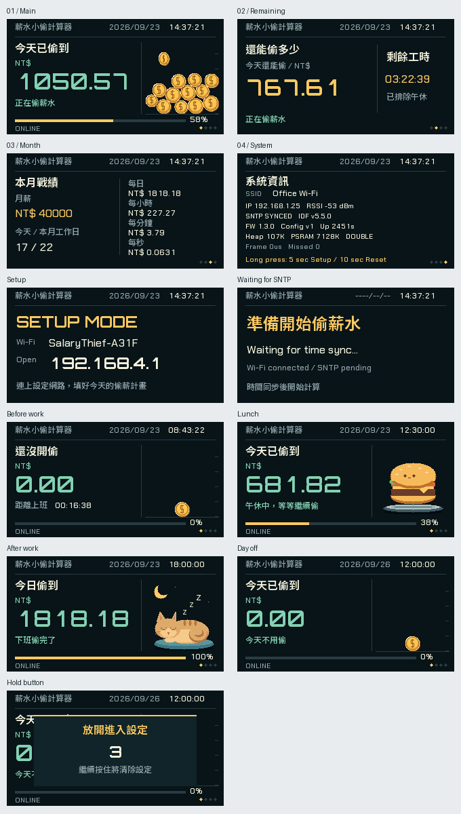

# 薪水小偷計算器

一個放在桌上的 ESP32-S3 薪資時鐘，依照月薪與工作排程，即時顯示今天已賺到的金額。上班時小金幣會掉落、碰撞並堆疊；午休換成輕晃的漢堡，下班後則是睡覺的小貓。

介面採繁體中文，使用 **320 × 170 橫向螢幕，USB 接口朝左**。專案以 PlatformIO、ESP-IDF、FreeRTOS 與 C++ 開發。



[硬幣動畫](docs/coin_physics.gif) · [堆疊近照](docs/stack_settled.png) · [午休動畫](docs/lunch.gif) · [下班動畫](docs/rest.gif)

## 功能

- 即時計算今日收入、剩餘金額與剩餘工時。
- 依當月實際工作日計算每日薪資，自動排除午休時間。
- 顯示日期、時間、工作狀態與本月薪資統計。
- 四個顯示頁面，透過板載按鈕切換。
- 三種可選螢幕風格：經典原版、琥珀終端、復古掌機。
- 使用手機網頁設定 Wi-Fi、月薪、工作日、上下班時間與時區。
- 設定儲存在 NVS，重新開機及 OTA 更新後保留。
- 每次開機自動檢查 GitHub Release，有新版時透過 HTTPS 更新。

## 硬體與開發環境

| 項目 | 規格 |
| --- | --- |
| 開發板 | LILYGO T-Display-S3，1.9 吋 ST7789 LCD |
| 晶片 | ESP32-S3R8，240 MHz |
| Flash | 16 MB QIO，80 MHz |
| PSRAM | 8 MB Octal，80 MHz |
| 開發工具 | PlatformIO Core 6.2.0 |
| 平台 | `espressif32@6.12.0`，ESP-IDF 5.5.0 |

此專案使用原版 T-Display-S3 的螢幕與接腳配置；AMOLED、Pro 與原始 ESP32 T-Display 需要另外調整驅動。

## 編譯與燒錄

安裝 Python 3.11 或 3.12，將開發板透過 USB 接上電腦後執行：

```sh
python -m pip install platformio==6.2.0
pio run
pio run -t upload
pio device monitor -b 115200
```

也可以使用 VS Code 的 PlatformIO 擴充套件進行 Build、Upload 與 Monitor。

若電腦有多個序列埠，可指定裝置，例如：

```sh
pio run -t upload --upload-port COM5
pio device monitor -p COM5 -b 115200
```

無法進入下載模式時，按住 BOOT、按一下 RST，再依序放開 RST 與 BOOT。上傳完成後按 RST 重新啟動。

預設建置環境為 `tdisplay_s3`，韌體輸出位於 `.pio/build/tdisplay_s3/firmware.bin`。需要停用 PSRAM 時，使用另一個環境：

```sh
pio run -e tdisplay_s3_no_psram
pio run -e tdisplay_s3_no_psram -t upload
```

工具鏈與 ESP-IDF 套件儲存在專案的 `.tools/platformio`，首次建置會下載所需套件。

## 第一次使用

1. 開機後，螢幕會顯示設定模式及 `SalaryThief-XXXX` Wi-Fi 名稱。
2. 用手機連上該 Wi-Fi，若提示沒有網際網路，選擇保持連線。
3. 在瀏覽器開啟 **http://192.168.4.1**。
4. 掃描或輸入家中／辦公室的 Wi-Fi 名稱與密碼。
5. 設定月薪、工作日、上下班時間、午休、時區與螢幕風格，按「儲存並重新開機」。
6. 裝置連上 Wi-Fi 並完成網路校時後，即開始顯示薪資進度。

預設排程為月薪 NT$40,000、週一至週五、09:00–18:00，午休 12:00–13:00，時區為 Asia/Taipei。

Wi-Fi 使用 2.4 GHz 網路，支援一般密碼或開放網路。設定 AP 沒有密碼，完成設定並重開機後會關閉。

可選時區：Asia/Taipei、Asia/Tokyo、Asia/Hong_Kong、Asia/Singapore、UTC。排程以同一天的當地時間計算，目前不包含跨午夜班別、國定假日或加班。

## 按鈕與畫面

兩顆板載按鈕的操作相同：

| 操作 | 功能 |
| --- | --- |
| 短按 | 切換下一頁 |
| 按住 5 秒後放開 | 進入設定模式 |
| 持續按住至 10 秒 | 清除設定並重新開機 |

GPIO0 同時是 BOOT 按鈕，一般開機時請勿按住。

各頁上方顯示日期 `YYYY/MM/DD` 與時間 `HH:MM:SS`。

| 頁面 | 內容 |
| --- | --- |
| 今天已偷到 | 今日收入、工作狀態、情境動畫與進度條 |
| 還能偷多少 | 今日剩餘金額與排除午休後的剩餘工時 |
| 本月戰績 | 月薪、工作日數及每日／每小時／每分鐘／每秒費率 |
| 系統資訊 | Wi-Fi、IP、訊號、校時狀態、版本、記憶體與運作時間 |

上班期間顯示金幣堆疊；午休時金額暫停增加，播放漢堡輕晃動畫；下班後顯示小貓休息。休假日顯示 NT$0.00，上班前顯示倒數。

## 螢幕風格

按住板載按鈕 5 秒後放開，連上設定 Wi-Fi 並開啟 `http://192.168.4.1`，在「04 / 螢幕風格」選擇後，按「儲存並重新開機」。

| 風格 | 畫面特色 |
| --- | --- |
| 經典原版（預設） | 深藍灰底、薄荷綠金額、金色進度與原本彩色動畫 |
| 琥珀終端 | 暖橘黑底、終端角框、動畫區掃描線與分格進度條 |
| 復古掌機 | 四階綠色、清晰像素字緣、掌機方框與格狀進度條 |

三種風格套用到全部四頁、設定提示與等待畫面，都保留日期、時間、金幣、完整漢堡輕晃與小貓睡覺動畫。風格會記住；從舊版升級時維持經典原版，原有 Wi-Fi 與薪資設定繼續沿用。

下圖由實際韌體繪圖程式產生，左至右為經典原版、琥珀終端、復古掌機。


## 薪資計算

```text
每日薪資 = 月薪 ÷ 當月工作日數
每日工時 = 上午工作時間 + 下午工作時間
每秒薪資 = 每日薪資 ÷ 每日工作秒數
今日收入 = 已工作秒數 × 每秒薪資
```

當月工作日數依設定的星期計算，因此不同月份的每日薪資可能不同。午休不計入工時，下班後收入停在當日薪資上限。

收入由目前時間重新計算，重新開機後不會從零累加。裝置每次開機都需要網路校時；完成校時後，即使暫時斷線也會繼續計算。

## 自動韌體更新

每次重新開機，裝置連上 Wi-Fi 並完成校時後，會等待 20 秒，向 [GitHub Releases](https://github.com/jonas7414/salary_clock/releases) 檢查一次版本。有新版就下載、驗證並重新啟動；沒有新版或檢查失敗時，繼續使用目前版本。

更新使用 HTTPS、SHA-256 驗證與兩個 4 MiB 的 A/B 韌體分區。新版通過 30 秒健康檢查後才確認生效，啟動失敗時可回滾到前一版。更新不清除 Wi-Fi 與薪資設定。

從沒有 OTA 的舊版升級時，需要先透過 USB 完整燒錄一次，安裝新的 bootloader、分區表與韌體；請勿使用 erase-flash，以保留原設定。

韌體版本集中在 `version.txt`。推送與該版本一致的 `vMAJOR.MINOR.PATCH` tag 後，GitHub Actions 會建置兩種組態，產生韌體與 SHA-256 檔案並發布 Release。

詳細流程、手動 API、分區配置及發布步驟見 [OTA 文件](docs/ota.md)。

## 專案結構

```text
src/                    應用程式初始化
components/
  app_core/             設定模型、薪資計算與共用邏輯
  app_config/           NVS 設定與 JSON 解析
  app_system/           系統事件、佇列與任務狀態
  button/               按鈕操作
  coin_physics/         硬幣物理模擬
  display/              LCD 驅動、畫面與動畫
  ota_manager/          版本檢查、下載、驗證與回滾
  salary/               薪資更新任務
  setup_portal/         網頁設定介面
  time_manager/         網路校時
  wifi_manager/         Wi-Fi 連線與設定模式
tools/                  建置、字型生成與測試工具
tests/                  主機端測試
docs/                   操作文件、預覽與驗證記錄
.github/workflows/      GitHub Actions 發布流程
```

## 開發與測試

完成一次韌體建置後，可使用 C++17 編譯器與 Pillow 執行主機端測試：

```sh
python -m pip install pillow
python tools/test_host.py --cxx clang++
python -m unittest discover -s tests -p test_release_tools.py -v
```

測試涵蓋薪資、日曆、設定、Wi-Fi 策略、動畫、NVS 與 OTA 邏輯，並在 `.artifacts/host` 產生畫面及動畫預覽。實板測試程序與建置記錄見 [驗證文件](docs/validation.md)。

字型子集已包含在原始碼中，平常建置不需要重新產生。修改介面文字或字型時，可執行：

```sh
python tools/generate_font.py /path/to/NotoSansTC.ttf --latin-font /path/to/ChakraPetch-Medium.ttf --display-font /path/to/Orbitron.ttf
```

## 常見問題

| 狀況 | 處理方式 |
| --- | --- |
| 開機後回到設定模式 | 確認 Wi-Fi 名稱、密碼與 2.4 GHz 訊號 |
| Wi-Fi 已連線但仍在等待 | 檢查網際網路、DNS 與 NTP 連線；校時完成後才會計薪 |
| 手機提示沒有網際網路 | 保持連上設定 AP，手動開啟 `http://192.168.4.1` |
| 想更換 Wi-Fi 或工作排程 | 按住按鈕 5 秒後放開，修改設定並重新開機 |
| 想切換螢幕風格 | 進入設定頁的「04 / 螢幕風格」，選擇後儲存並重新開機 |
| 午休或下班後金額不再增加 | 依工作排程暫停計薪，屬正常行為 |
| 每月的每日薪資不同 | 每日薪資依當月實際工作日數計算 |
| LCD 黑屏或方向錯誤 | 確認板型為 1.9 吋 T-Display-S3，並將 USB 接口朝左 |
| 沒有自動更新 | 確認已安裝支援 OTA 的版本、完成校時，且 Release 版本高於本機版本；重新開機再次檢查 |

## 參考與素材授權

- [LILYGO T-Display-S3](https://github.com/Xinyuan-LilyGO/T-Display-S3)：硬體與接腳配置。
- [LILYGO ESP-IDF 範例](https://github.com/Xinyuan-LilyGO/LilyGo-Display-IDF/blob/master/main/display_s3.c)：面板初始化參考，見 [MIT 授權](licenses/LILYGO-MIT.txt)。
- [Noto Sans TC](https://github.com/google/fonts/tree/main/ofl/notosanstc)：中文字型，見 [SIL OFL 1.1](licenses/NotoSansTC-OFL.txt)。
- [Orbitron](https://github.com/google/fonts/tree/main/ofl/orbitron)：大型英數字型，見 [SIL OFL 1.1](licenses/Orbitron-OFL.txt)。
- [Chakra Petch](https://github.com/google/fonts/tree/main/ofl/chakrapetch)：小型英數字型，見 [SIL OFL 1.1](licenses/ChakraPetch-OFL.txt)。
