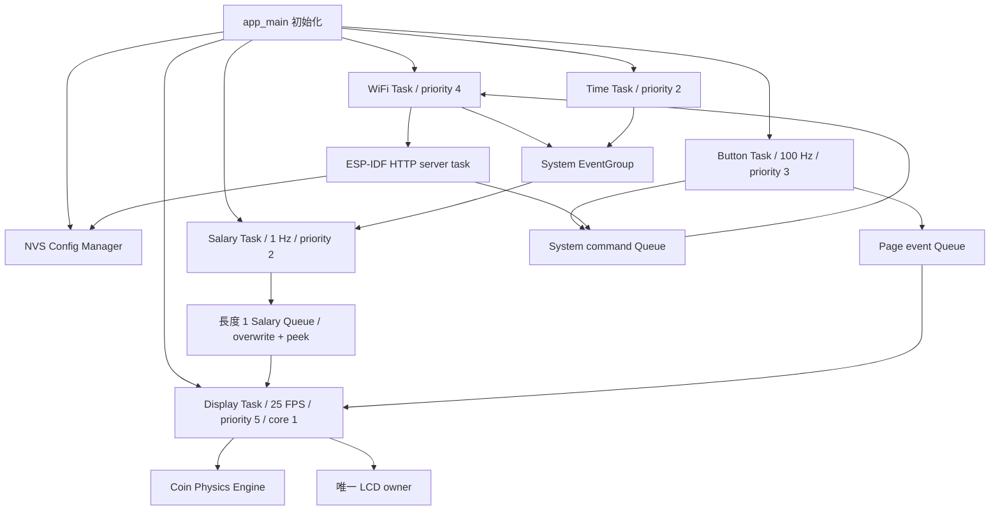

# 薪水小偷計算器

放在桌上的 Salary Thief Calculator：科技感數字顯示今天已賺到的金額，旁邊的小金幣會受重力、反彈、摩擦影響，並互相碰撞、逐層堆疊。產品介面使用繁體中文，顯示方向是 **320 × 170 橫向，USB 接口在左側**。

使用 PlatformIO、ESP-IDF、FreeRTOS 與 C++。不使用 Arduino Framework、Arduino Core、TFT_eSPI 或瀏覽器 CDN。韌體內含完整離線設定網頁與繁體中文字型子集。

[橫向畫面預覽](docs/screens.png) · [硬幣物理示範](docs/coin_physics.gif) · [堆疊近照](docs/stack_settled.png) · [吃飯動畫](docs/lunch.gif) · [下班休息動畫](docs/rest.gif)

## 硬體與固定版本

- LILYGO T-Display-S3，1.9 吋 ST7789 170 × 320 面板，以橫向使用；不是 AMOLED、Pro 或原始 ESP32 T-Display。
- ESP32-S3R8、16 MB QIO flash @ 80 MHz、8 MB Octal PSRAM @ 80 MHz；CPU 240 MHz。
- PlatformIO Core 6.1.18；`espressif32@6.12.0`，對應 ESP-IDF 5.5 系列。
- 使用 PlatformIO 原生 `lilygo-t-display-s3` board；另明確指定 flash mode、容量、partition table 與 ESP-IDF sdkconfig。
- 不需要外部 ESP-IDF component；全部周邊 API 都來自 ESP-IDF，故不需 `idf_component.yml`。

| 功能 | GPIO |
| --- | --- |
| LCD peripheral power / Backlight | 15 / 38 |
| LCD reset / CS / DC / WR / RD | 5 / 6 / 7 / 8 / 9 |
| LCD D0…D7 | 39, 40, 41, 42, 45, 46, 47, 48 |
| 按鈕 1 / 按鈕 2 | 0 / 14，active low |

LCD 使用 `esp_lcd` 8-bit 8080 bus @ 10 MHz，ST7789 原生驅動，LILYGO 面板初始化參數，`swap_xy=true`、`mirror(false,true)`、gap `(0,35)`。GPIO15 先拉高、RD 拉高、畫好第一幀後才開背光。

## 編譯、燒錄、監看

安裝 Python 3.11/3.12 與 PlatformIO Core，或使用 VS Code 的 PlatformIO 擴充套件。

```sh
python -m pip install platformio==6.1.18
pio run
pio run -t upload
pio device monitor -b 115200
```

多個序列埠時請明確指定，例如：

```sh
pio run -t upload --upload-port COM5
pio device monitor -p COM5 -b 115200
```

上傳會更換板上韌體，請先確認序列埠。若無法進入下載模式，按住 BOOT、按一下 RST，放開 RST 再放開 BOOT；上傳後按 RST。Console 使用原生 USB Serial/JTAG，不會等待 USB 連線才啟動。

輸出位於 `.pio/build/tdisplay_s3/firmware.bin`、`firmware.elf`、`bootloader.bin`、`partitions.bin`。Partition：NVS 24 KiB、PHY 4 KiB、factory app 4 MiB，剩餘 flash 保留為 storage（目前不掛載）；無 OTA 功能。

明確停用 PSRAM 的驗證組態：

```sh
pio run -e tdisplay_s3_no_psram
```

預設組態也啟用 `CONFIG_SPIRAM_IGNORE_NOTFOUND`。偵測不到 PSRAM 或兩張 frame buffer 配置失敗時，會改用 internal RAM 的 10-row buffer。

修改 defaults 後，既有的 `sdkconfig.tdisplay_s3` 可能保留舊值；重新產生該 environment 的 sdkconfig，或使用 `pio run -t menuconfig` 檢查。不要把 PSRAM 的 SDK 設定套在 AMOLED 或其他硬體型號上。

`platformio.ini` 已設定 `core_dir = .tools/platformio`，讓 VS Code 的全域 PlatformIO 與專案內的 CLI 共用已下載的工具鏈及 ESP-IDF Python 環境，不需要為同一個專案再下載一份。保留此專案的 `.tools/platformio` 目錄；首次解壓原始碼到新電腦時仍需下載套件。

如果先前 VS Code Upload 已開始重複下載，先在該工作終端按 `Ctrl+C`，再執行 Upload，新的程序才會讀到此設定。若自行設定過 `PLATFORMIO_CORE_DIR` 等 PlatformIO 目錄環境變數，需移除衝突值，因為環境變數優先於 ini。

本次工作環境另有專案內 `.tools/venv`，不修改系統 Python。PowerShell 可用：

```powershell
.\.tools\venv\Scripts\pio.exe run
```

`tools/pio_bounded.py run` 是選用的下載輔助入口：針對慢速套件鏡像使用有限逾時及分段下載，仍由 PlatformIO 比對官方 SHA256；一般環境直接 `pio run` 即可。此工具不改變韌體的建置內容。

## 第一次設定

1. 沒有設定、CRC 錯誤或設定版本不符時，自動啟動 APSTA。
2. LCD 顯示 `SETUP MODE`、`SalaryThief-XXXX` 與 `192.168.4.1`。XXXX 是 SoftAP MAC 最後四個十六進位字元。
3. 手機連上此開放 Wi-Fi，選擇「仍保持連線」，在瀏覽器開啟 **http://192.168.4.1**。沒有自動 captive-portal DNS 轉址。
4. 按 Scan Wi-Fi；點選 SSID，或手動輸入隱藏網路。輸入密碼；開放網路留空。不支援企業 EAP 帳號登入。
5. 設定月薪、工作日、上下班、午休與時區，按「儲存並重新開機」。
6. 裝置連上 Wi-Fi、取得 IP 並完成 SNTP 後才開始計薪。若開機 20 秒內未連上基地台，回到設定 AP；已連上基地台時，另從連上當下等待 DHCP 最多 60 秒，才判定無法取得 IP。

預設：NT$40,000、週一至週五、09:00 上班、12:00–13:00 午休、18:00 下班、Asia/Taipei。這些只在沒有有效設定時填入表單；正常執行讀取 NVS。

支援時區：Asia/Taipei、Asia/Tokyo、Asia/Hong_Kong、Asia/Singapore、UTC，明確轉成 POSIX TZ 後呼叫 `setenv` / `tzset`。未宣稱支援完整 IANA 時區資料庫。排程是同一天的當地時間，不支援跨午夜班別、國定假日與加班。

有效排程必須滿足 `work_start < lunch_start < lunch_end < work_end < 24:00`；月薪為 1–1,000,000,000 整數；至少一個工作日。SSID 上限 32 bytes，密碼為空、8–63 bytes 或 64 位十六進位 PSK。

## 四個橫向頁面與按鈕

各頁上方顯示日期（`YYYY/MM/DD`）與時間（`HH:MM:SS`），依設定時區自動更新；日期在時間同步前顯示 `----/--/--`。

兩顆按鈕都有相同行為：短按換頁；按住五秒後放開進入設定；持續按至十秒清除本產品設定並重新開機。五秒時不會重新開機，因此十秒操作可以完成。GPIO0 同時是 BOOT strap；上電時不要按住它，除非要進下載模式。

1. **今天已偷到**：大金額、時間、狀態、情境動畫、進度條。上班顯示硬幣；午休金額不變，改播漢堡輕晃動畫；下班改播小貓睡覺動畫；休假日 NT$0.00；上班前顯示倒數。
2. **還能偷多少**：剩餘金額與「剩餘工時」，明確排除午休，並非牆上時鐘的下班倒數。
3. **本月戰績**：月薪、截至今天的工作日序號／本月工作日總數、每日／每小時／每分鐘／每秒費率。休假日序號代表截至當日已到達的工作日數。
4. **系統資訊**：SSID、IP、RSSI、SNTP、IDF／韌體／Config 版本、internal heap、PSRAM、uptime、繪製耗時與逾期幀數。

任一正常頁面短按都會前往下一頁。設定中優先顯示連線資訊；在設定 AP 裡儲存並重開機，或使用網頁「重新開機」退出。

## FreeRTOS 架構



所有 task priority / stack 都集中在 `components/app_system/include/app_system.h`。週期 task 使用 `vTaskDelayUntil`；等待同步使用 EventGroup；HTTP 接收和 DMA semaphore 都有 timeout。`app_main()` 不包含業務循環。

- `WIFI_CONNECTED_BIT`：取得 IP 後設定，斷線或失去 IP 時清除，供 SNTP 判斷網路是否就緒。
- `WIFI_ASSOCIATED_BIT`：已連上基地台，可能仍在等 DHCP；`WIFI_CONNECTING_BIT`：掃描／認證進行中；`WIFI_STARTED_BIT`：STA 已啟動。等 IP 或連線進行中均不重複呼叫 connect。
- `TIME_SYNCED_BIT`：真正收到 SNTP callback 才設定；斷線後不清除，繼續用 system clock 計薪。
- `CONFIG_READY_BIT`：啟動時載入有效 NVS。
- `SETUP_MODE_BIT`：APSTA 設定入口開啟。
- `SYSTEM_ERROR_BIT`：例如 LCD 傳輸失敗。

SystemState 由以上 bits 推導成 booting、setup、connecting、syncing、running、error，不由多個 task 同時亂寫。網路／顯示診斷用 mutex snapshot，薪資用單格 queue，頁面與系統操作分開排隊。Display Task 是唯一初始化、畫圖及傳輸 LCD 的 task。

連線失敗／斷線事件之後等待五秒再嘗試，已進行中的連線不會每五秒被重新呼叫。初次開機未連上基地台的期限為 20 秒；連上基地台後，DHCP 有獨立的 60 秒期限。從未取得 IP 且 DHCP 逾時才回設定模式；曾取得 IP 的裝置會在逾時後中斷卡住的連線並背景重試，已同步的薪資時鐘維持運作。RSSI 僅在已連上基地台且非設定模式時每秒查詢。

SNTP 等待超過 30 秒會顯示提示並繼續重試，不會拿未校準時間算錢。沒有電池 RTC，重開機後必須重新 SNTP。v1.0.1 修正「已連上 Wi-Fi、尚未取得 IP」被誤判為連線失敗，以及未連線時每 250 ms 查詢 AP 資訊的警告洗版。

## NVS 與 Web API

Namespace `salary_thief`，單一 `config` blob 包含 magic、大小、CRC32、AppConfig 與版本。SSID／密碼／薪資／星期 bitmask／四個時間／時區一起寫入並 commit，避免欄位分批寫入造成不一致。CRC 供損毀偵測，不是加密。預設未啟用 flash/NVS encryption。

儲存先持久化，所有 task 的 active configuration 到重開機才切換，避免不同 task 看到不同排程或時區。Factory reset 僅清除此產品 namespace；只有 NVS 初始化回報整個 partition 不相容或無可用 page 時，才按 ESP-IDF 復原流程 erase NVS partition。

| Route | 行為 |
| --- | --- |
| `GET /` | Firmware 內嵌的 HTML/CSS/vanilla JavaScript |
| `GET /api/scan` | APSTA 的 STA 掃描，顯示最多 20 筆 SSID/RSSI/security |
| `GET /api/config` | active 設定與 `has_password`，絕不輸出密碼 |
| `GET /api/status` | 裝置狀態與診斷數值，無密碼 |
| `POST /api/config` | 驗證 JSON、commit NVS，回傳 `reboot_required` |
| `POST /api/reboot` | 回應 202 後排程重開機 |
| `POST /api/reset` | 回應 202 後清除此產品設定並重開機 |

HTTP server 只在設定模式啟動；設定期間 STA 不嘗試連線，方便掃描且不把入口暴露在已連線的 LAN。設定 AP 沒有密碼，完成後應重開機關閉它。

寫入需 `Content-Type: application/json`、`X-SalaryThief-Request: setup`，不開放 CORS，拒絕重複 JSON key／巢狀容器／字串內 NUL，限制 body 2 KiB 及接收時間。省略 `wifi_password` 只允許在 SSID 相同時保留舊密碼；傳入空字串表示開放網路。程式及網頁不 log 密碼，GET 不回傳；網路 SSID 使用 `textContent` 顯示，不插入 HTML。

## 薪資演算法

星期 bitmask：週一 bit 0 … 週日 bit 6。純 Gregorian 日曆函式依年、月、bitmask 計算實際工作日，處理閏年與世紀規則。

```text
dailyWorkSeconds = (lunchStart - workStart) + (workEnd - lunchEnd)
dailySalary = monthlySalary / monthlyWorkDays
salaryPerSecond = dailySalary / dailyWorkSeconds
earnedMoney = workedSeconds(now) * salaryPerSecond
remainingMoney = max(0, dailySalary - earnedMoney)
remainingWorkSeconds = dailyWorkSeconds - workedSeconds
```

`workedSeconds` 在上班前為零、上午增加、午休維持、下午繼續、下班後封頂；非工作日已賺／剩餘金額及剩餘工時都為零。所有金額用 `double`，UI 保留兩位；每秒費率在戰績頁顯示四位。不用累加金額；同一設定與當地日期時間在重開機後得到同一結果。

## 硬幣物理與顯示

固定 pool 16 顆，直徑 18–24 px；左右牆、地板與硬幣彼此都有碰撞，可逐層堆疊。滿額時回收最高的一顆，保留底部支撐，不做每幀配置。重力 560 px/s²；初速、角速度、半徑、彈性與摩擦略有不同。反彈係數 0.34–0.49、摩擦 0.52–0.67；空氣與角速度阻尼以 dt 指數衰減。有支撐且低速持續 0.35 秒後進入 sleeping；撞擊或失去支撐會喚醒，整堆靜止後略過碰撞求解。

時間使用 `esp_timer_get_time`，dt 上限 0.05 秒，再切成不超過 1/240 秒的 substeps，每步最多十輪接觸求解。大型延遲會放慢該段動畫，不會讓物體飛出邊界。畫面 40 ms / 25 FPS 目標，薪資時間仍獨立以 system clock 計算。

正常工作時跨過整數 NT$1 門檻生成一顆，最短間隔 2.5 秒；不補播重開機前已賺金額。午休停止生成，右側改播完整漢堡左右輕晃、微微上下浮動的循環動畫；原堆疊保留，下午上班再顯示。下班後改播月亮下的小貓睡覺，搭配呼吸起伏與飄動的 Zzz，不再掉落慶祝硬幣。動畫使用獨立的毫秒時間，午休與下班金額不變時也會持續播放。硬幣數量是視覺效果，不等於實際金額，也不寫入 NVS；跨日會清空。

硬幣使用外圈、內圈、金屬色差、移動高光與隨尺寸縮放的 `$` 符號；空中以旋轉控制假 3D 翻轉，停下時恢復正面圓形，讓視覺邊緣符合實際碰撞位置。撞擊有輕微 squash，金額增加時上移最多 2 px；硬幣只繪在右側動畫區，不會遮住金額或時間。

PSRAM 路徑配置兩張 108,800-byte RGB565 frame，先離屏完成畫面，再比對 10-row 分區，只送出改變區域。無 PSRAM 使用單張 6,400-byte internal DMA strip，逐區完整合成同一份 snapshot；雜湊略過不變區域並定期更新。每次傳輸等 ISR semaphore 完成才重用 DMA buffer，不會畫到還在送出的記憶體。

沒有先清 LCD 再逐個畫物件的閃爍；但此板的 TE 訊號未接到本版驅動，軟體雙緩衝不能保證面板掃描完全沒有 tearing。25 FPS 是排程目標；實際耗時／掉幀可從資訊頁或 API 量測，仍需目標板驗證。

金額與大型英數使用 Orbitron，小型英數使用 Chakra Petch Medium，中文使用 Noto Sans TC 並加強標題字重。數字採等寬字格，避免金額與秒數因字寬變化左右晃動。三種字型都是 4-bit coverage 子集，已生成並放入 source，正常 build 不需 Python/Pillow 或下載字型。改文案後執行：

```sh
python -m pip install pillow
python tools/generate_font.py /path/to/NotoSansTC.ttf --latin-font /path/to/ChakraPetch-Medium.ttf --display-font /path/to/Orbitron.ttf
```

目前字型覆蓋 UI 所需中文字與 ASCII，非子集 SSID 字元在小螢幕會顯示 `?`，完整 UTF-8 SSID 仍可在設定網頁使用。

## 驗證

2026-09-23：v1.1.0 已完成 `pio run -e tdisplay_s3 -e tdisplay_s3_no_psram`，兩者均 SUCCESS；1,539,918 項主機檢查通過，包含吃飯／下班休息動畫、小硬幣堆疊與原有 Wi-Fi／DHCP 回歸案例。沿用現有工具鏈，沒有重新下載套件。韌體大小、有效組態與 SHA256 見 [建置結果](docs/build-results.json)，本次更新的實板驗收尚未執行。

主機測試直接編譯韌體共用的 C++ 演算法、物理、動畫政策與 renderer，另外用 NVS adapter fake 編譯真正的 `app_config.cpp`，並以 ESP-IDF 的 cJSON 編譯同一份設定解析器。先完成 `pio run` 取得 ESP-IDF；測試還需要 C++17 compiler 與 Pillow，可選 Zig 作為 Windows host compiler：

```sh
python -m pip install pillow ziglang==0.13.0
python tools/test_host.py --cxx clang++
# Windows 本專案環境：
.tools/venv/Scripts/python.exe tools/test_host.py --zig .tools/venv/Lib/site-packages/ziglang/zig.exe
```

包含每日 86,400 個時間點、29,000 筆左右的 Python `calendar` 獨立月曆答案、排程邊界／週末／跨年、動態排程與薪資、tick wrap、Wi-Fi 重試政策、NVS 損毀與 commit failure、dt spike、16 枚硬幣碰撞／支撐／休眠／容量回收、20/30 FPS 物理一致性、午休與下班不生成硬幣、11 個螢幕狀態及吃飯／休息動畫完整循環的整幀／分區逐像素一致性、guard pixels 越界及動畫區域邊界檢查。

測試生成 `.artifacts/host/results.txt`、`screens.png`、`coin_physics.gif`、`stack_settled.png`、`lunch.gif`、`rest.gif`。吃飯與休息 GIF 分別為 4.8 秒與 4 秒，使用實際 renderer 的完整循環；16 秒硬幣 GIF 使用實際 renderer 與 25 FPS 物理更新，為快速展示堆疊，只有生成間隔加快至 0.72 秒；實際使用最短 2.5 秒。這些是主機預覽，不是實板照片。`tools/portal_preview.py` 是本機假 API 的 UI 預覽工具，不連接任何真實裝置。

實板驗收程序和本次證據見 [docs/validation.md](docs/validation.md)。不要把 host tests 或成功連結視為 RF、LCD 電氣或實板 FPS 的證據。

## 疑難排解

| 現象 | 檢查 |
| --- | --- |
| 20 秒後又出現 Setup | SSID/密碼、2.4 GHz 訊號、是否企業 EAP 網路 |
| Wi-Fi 已連線但一直 Waiting | Internet、DNS、UDP 123；SNTP 未成功前不會計薪 |
| `Station associated; waiting for DHCP` | 已連上基地台，等待路由器分配 IP；接下來應看到 `Station obtained IP`。若 60 秒後 DHCP 逾時，檢查路由器 DHCP／位址池，或用手機 2.4 GHz 熱點比對 |
| 手機說沒有 Internet | 保持連上 SalaryThief AP，手動開 http://192.168.4.1 |
| 想更換 Wi-Fi 或排程 | 長按五秒後放開，設定頁儲存並重開機 |
| LCD 黑屏／方向不符 | 確認是 1.9 吋 T-Display-S3、GPIO15、RD、USB 在左的方向 |
| 顏色異常 | 確認 RGB565 byte swap、RGB element order 與 inversion，不要混用 AMOLED 驅動 |
| PSRAM 不可用 | 查看 log 是否 PARTIAL，或編譯 no_psram environment |
| 下班後／午休金額沒增加 | 正常排程行為；資訊頁檢查同步，設定頁檢查排程 |
| 當月每日金額和上月不同 | 使用當月實際工作日，不固定 22 天 |
| 工具鏈下載卡住 | 檢查 PlatformIO 鏡像連線；可用選用的 bounded wrapper |
| VS Code Upload 又下載同一套工具鏈 | 確認 `core_dir = .tools/platformio`、該目錄仍存在，並停止舊工作後重新 Upload |

## 官方參考與授權

- [LILYGO 硬體、pinout、Flash / PSRAM](https://github.com/Xinyuan-LilyGO/T-Display-S3)
- [LILYGO 原生 ESP-IDF 面板範例](https://github.com/Xinyuan-LilyGO/LilyGo-Display-IDF/blob/master/main/display_s3.c)
- [PlatformIO board](https://docs.platformio.org/en/stable/boards/espressif32/lilygo-t-display-s3.html)
- [固定的 PlatformIO 平台版本與套件](https://github.com/platformio/platform-espressif32/blob/v6.12.0/platform.json)
- [ESP-IDF 5.5 I80 LCD API](https://docs.espressif.com/projects/esp-idf/en/v5.5/esp32s3/api-reference/peripherals/lcd/i80_lcd.html)
- [ESP-IDF Wi-Fi 連線事件與取得 IP 的區別](https://docs.espressif.com/projects/esp-idf/en/v5.5/esp32s3/api-guides/wifi.html#wifi-event-sta-connected)
- [Noto Sans TC](https://github.com/google/fonts/tree/main/ofl/notosanstc)，SIL OFL 1.1，見 `licenses/NotoSansTC-OFL.txt`。
- [Orbitron](https://github.com/google/fonts/tree/main/ofl/orbitron) 與 [Chakra Petch](https://github.com/google/fonts/tree/main/ofl/chakrapetch)，SIL OFL 1.1，見 `licenses/Orbitron-OFL.txt`、`licenses/ChakraPetch-OFL.txt`。
- 面板 timing / gamma 參數引用 LILYGO MIT 範例，見 `licenses/LILYGO-MIT.txt`。
