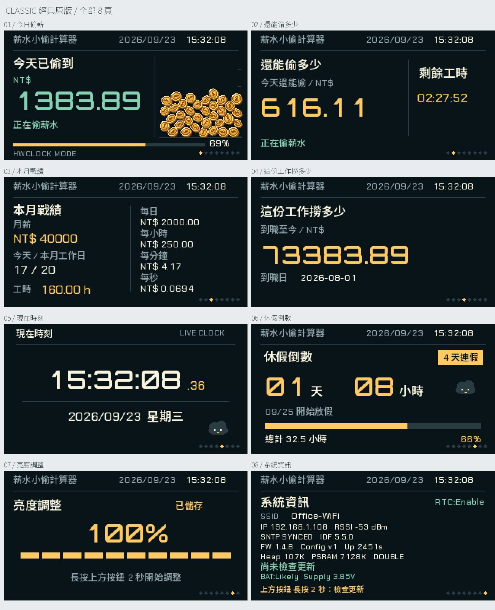
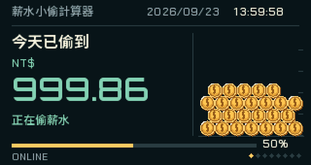
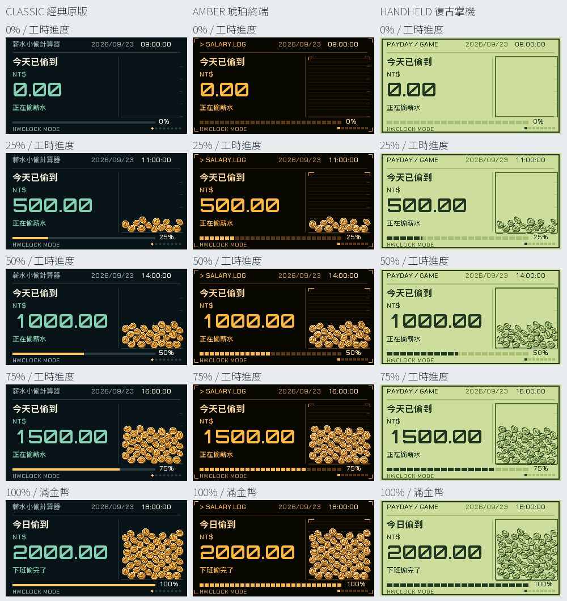
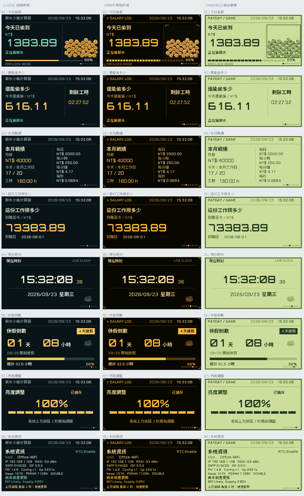

# 薪水小偷計算器

把今天賺到的薪水，變成桌上看得見的金幣。

這是一款為 **LILYGO T-Display-S3** 製作的繁體中文薪資時鐘。輸入月薪與上下班時間，就能查看今日收入、剩餘工時、到職累積與下一次休假；金幣隨有效工時逐枚累積，午休換成漢堡，下班時剛好集滿。

**[使用手冊](docs/user-manual.md)** · [快速開始](#快速開始) · [三種螢幕風格](#三種螢幕風格) · [開發指南](docs/development.md) · [韌體下載](https://github.com/jonas7414/salary_clock/releases)



圖片由目前原始碼的實際繪圖程式渲染，使用固定示例日期 2026/09/23、月薪 NT$40,000 與模擬系統資訊，並非實機照片或即時資料。韌體版本以 [version.txt](version.txt) 為準。

## 一天的桌上陪伴



[開機動畫](docs/boot.gif) · [金幣堆疊近照](docs/stack_settled.png) · [午休動畫](docs/lunch.gif) · [下班滿金幣](docs/rest.gif) · [休假動畫](docs/holiday.gif)

金幣直徑約 12–14 像素，保留傾斜幣面、厚邊與光影；從隨機位置落下、碰撞回彈，自然堆積，一天共 **52 枚**。每枚代表「當日有效工時 ÷ 52」，午休不增加；8 小時工時約每 9 分 14 秒新增一枚，最後一枚在下班時出現，下班後保留滿金幣。重開機會依當天已完成工時還原，不從零開始，也不因月薪較高而提早裝滿。上方動畫示範 14:00 達到一半工時時新增第 26 枚。



- **看見工作進度**：今日收入、今日剩餘金額、剩餘工時，以及每日、每小時、每分鐘、每秒的薪資費率。
- **回顧這份工作**：設定到職日，依目前月薪與排程估算至今累積收入。
- **期待下一次休假**：依台灣政府行事曆顯示休假倒數與連假天數，納入國定假日與補班日。
- **打造自己的桌面時鐘**：八頁自由排序、三種風格、10%–100% 亮度與每日自動開關螢幕。
- **記住重要日子**：最多五個紀念日，各自選擇是否每年重複，時鐘頁每五秒輪播。
- **用手機完成設定**：連上裝置 Wi-Fi，在瀏覽器調整設定；已存設定在重新開機與 OTA 更新後保留。
- **持續對時與更新**：網路校時、自動更新行事曆、經使用者確認才安裝新版韌體；選配 DS3231 可離線開機對時。

## 快速開始

準備已燒錄本韌體的 **原版 T-Display-S3（1.9 吋 ST7789）**、USB-C 電源、手機，以及可連上網際網路的 **2.4 GHz Wi-Fi**。螢幕橫放，**USB 接口朝左**；AMOLED、Pro 與舊款 ESP32 T-Display 不適用此韌體配置。

1. 接上電源，等待約五秒開機動畫。首次使用會顯示設定 Wi-Fi 名稱 `SalaryThief-XXXX`。
2. 用手機連上該 Wi-Fi；若提示「沒有網際網路」，選擇保持連線。
3. 在瀏覽器開啟 **http://192.168.4.1**。
4. 填入日常使用的 Wi-Fi、月薪、到職日、上下班與午休時間，確認時區。
5. 按「儲存並重新開機」。裝置連線並取得有效時間後，即可查看薪資畫面。

預設月薪 NT$40,000，上班 09:00、下班 18:00、午休 12:00–13:00；時區 Asia/Taipei，螢幕每天 08:00–19:00 開啟。到職日預填 2026-08-01，請改成自己的日期。

設定 Wi-Fi 沒有密碼，重開機回到正常模式後會關閉。之後想修改設定，快速連按 **下方按鈕** 兩下即可再次進入設定模式。完整步驟見 [第一次使用](docs/user-manual.md#第一次使用)。

## 每天最常用的操作

| 想做什麼 | 操作 |
| --- | --- |
| 上一頁／下一頁 | 短按上方按鈕／下方按鈕 |
| 修改 Wi-Fi、薪資或螢幕設定 | 快速連按下方按鈕兩下，再用手機連上設定 Wi-Fi |
| 調整亮度 | 到「亮度調整」頁，長按上方按鈕 2 秒；上方按鈕調暗、下方按鈕調亮，再長按上方按鈕 2 秒儲存 |
| 夜間暫時看時間 | 排程關屏時按下方按鈕，亮屏 5 分鐘 |
| 深度睡眠／喚醒 | 按住下方按鈕 5 秒後放開進入睡眠；睡眠時再次按住約 5 秒喚醒 |
| 檢查韌體更新 | 到「系統資訊」頁，長按上方按鈕 2 秒 |

亮度編輯與韌體更新提示有專用按鈕操作，詳見 [按鈕速查](docs/user-manual.md#按鈕速查)。

## 三種螢幕風格

| 經典原版 | 琥珀終端 | 復古掌機 |
| --- | --- | --- |
| 深藍灰底、薄荷綠金額與彩色動畫 | 暖橘配色、終端角框與分格進度 | 四階綠色、像素字緣與掌機方框 |

三種風格涵蓋全部八頁。在手機設定頁的「螢幕」選擇後，儲存並重新開機即可套用。下圖由左至右為經典原版、琥珀終端、復古掌機。



## 薪資數字怎麼來

```text
每日薪資 = 月薪 ÷ 當月工作日數
每秒薪資 = 每日薪資 ÷ 每日工作秒數（扣除午休）
今日收入 = 每秒薪資 × 今天已工作秒數
```

工作日依台灣政府行事曆，上班時累計、午休暫停、下班封頂，休假日今日收入為零。例：內建的 2026 年 9 月有 20 個工作日；月薪 NT$40,000、每天工作 8 小時，對應每日 NT$2,000、每小時 NT$250。

這是依排程估算的桌上時鐘，不記錄打卡、請假、加班、扣款或歷年月薪異動。修改月薪後，到職累積會用新月薪重算。排程需在同一天內，工作日固定依台灣行事曆；改時區不會改成其他國家的假日。

目前內建 2026–2027 年行事曆，另可下載今年與明年資料。若到職期間缺少歷史行事曆，會顯示提示，不顯示不完整的累積金額。更多說明見 [收入與休假如何計算](docs/user-manual.md#收入與休假如何計算)。

## 給開發者

本專案使用 **PlatformIO、ESP-IDF、C++17 與 FreeRTOS**；手機設定頁是嵌入韌體的單一 HTML。開發板配置為 ESP32-S3、16 MB Flash、8 MB PSRAM、320 × 170 LCD，另提供不使用 PSRAM 的分條渲染組態。

從專案根目錄建置：

```sh
python -m pip install platformio==6.2.0
pio run -e tdisplay_s3 -e tdisplay_s3_no_psram
```

需要安裝到開發板時，再以 USB 連線並執行：

```sh
pio run -e tdisplay_s3 -t upload
pio device monitor -b 115200
```

韌體產物位於 `.pio/build/<environment>/firmware.bin`，工具鏈在 `.tools/platformio`。從沒有 OTA 的舊分區配置升級，需要 USB 完整燒錄 bootloader、分區表與韌體；詳見 [OTA 文件](docs/ota.md)。

| 文件 | 內容 |
| --- | --- |
| [使用手冊](docs/user-manual.md) | 首次設定、八個頁面、日常操作、更新與疑難排解 |
| [AGENTS.md](AGENTS.md) | 開發工具與貢獻者應遵守的修改慣例 |
| [架構與資料流](docs/architecture.md) | 模組、任務、頁面與儲存模型 |
| [HTTP 與內部 API](docs/api.md) | 設定契約、狀態欄位與錯誤 |
| [開發與驗證指南](docs/development.md) | 建置、主機測試、字型、demo 重繪與發版 |
| [驗證記錄](docs/validation.md) | 測試程序及既有驗證範圍 |
| [行事曆](docs/taiwan-calendar.md)／[電池](docs/battery.md)／[OTA](docs/ota.md) | 各功能的技術說明 |

## 參考與素材授權

- [LILYGO T-Display-S3](https://github.com/Xinyuan-LilyGO/T-Display-S3)：硬體與接腳配置；面板初始化參考的 [ESP-IDF 範例](https://github.com/Xinyuan-LilyGO/LilyGo-Display-IDF/blob/master/main/display_s3.c) 授權見 [MIT 聲明](licenses/LILYGO-MIT.txt)。
- Noto Sans TC、Orbitron、Chakra Petch 字型：[Noto Sans TC 授權](licenses/NotoSansTC-OFL.txt)、[Orbitron 授權](licenses/Orbitron-OFL.txt)、[Chakra Petch 授權](licenses/ChakraPetch-OFL.txt)。
- 台灣行事曆來源與授權：[Taiwan Calendar 聲明](licenses/TaiwanCalendar-NOTICE.md)。
