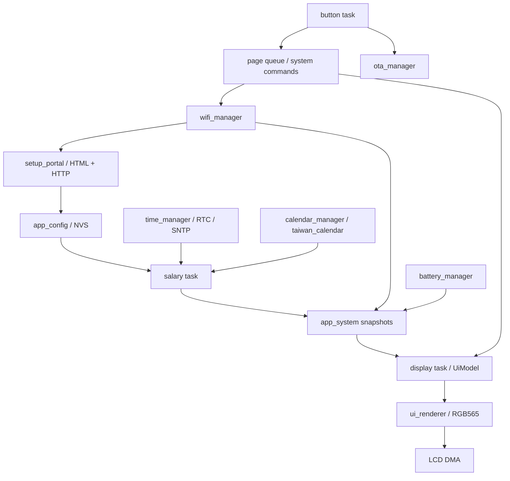

# 專案架構

## 硬體與執行環境

- LILYGO T-Display-S3，ESP32-S3，16 MB Flash，320×170 橫向 LCD。
- PlatformIO `espressif32@6.12.0`、ESP-IDF；目前套件為 ESP-IDF 5.5.0，以建置輸出為準。
- 兩種組態：`tdisplay_s3` 使用 PSRAM；`tdisplay_s3_no_psram` 使用分條渲染以控制 RAM。
- 上方按鈕接腳為 `GPIO_NUM_0`；下方按鈕為 `GPIO_NUM_14`。這是工程接腳對照；介面文案只使用上下方名稱。
- 選配 DS3231 RTC 透過 I²C 提供離線開機時間。電池狀態來自 ADC 電壓推估，不是充電量或接頭偵測器。

## 啟動流程

入口：[src/main.cpp](../src/main.cpp) 的 `app_main()`。

先處理睡眠喚醒，再初始化系統同步物件、NVS 與設定。顯示 task 先啟動播放開機動畫，其後啟動電池、按鈕、行事曆、薪資、時間、Wi-Fi 與 OTA。動畫不阻塞網路校時；部分非必要服務啟動失敗只記錄警告。啟動過程使用 watchdog，支援 OTA 待確認映像回滾。

## 模組責任

| 目錄 | 責任與主要入口 |
| --- | --- |
| `components/app_core` | 可在主機測試的設定型別、薪資數學、行事曆、按鈕狀態機、螢幕排程、電池與 OTA 狀態型別 |
| `components/app_config` | NVS 讀寫、CRC、偏好遷移、JSON 設定驗證 |
| `components/app_system` | event group、queue、狀態 snapshot/publish、task heartbeat、下載互斥 |
| `components/salary` | 每 1000 ms 計算薪資並發布 `SalaryStatus` |
| `components/display` | LCD 初始化、buffer/DMA、UiModel 組裝、動畫與實際繪圖 |
| `components/coin_physics` | 不依賴硬體的硬幣物理模擬 |
| `components/button` | 10 ms 輪詢實體按鍵、輸入模式、更新提示操作、deep sleep |
| `components/wifi_manager` | STA 連線、AP 設定模式、系統指令消費與重啟／重設流程 |
| `components/setup_portal` | 內嵌 HTML 與七條 HTTP 路由，見 [API](api.md) |
| `components/time_manager` | RTC 讀寫、SNTP、時區與時間有效性 |
| `components/calendar_manager` | HTTPS 下載、驗證、NVS 快取今年與明年的行事曆 |
| `components/battery_manager` | ADC 採樣、校正與供電狀態發布 |
| `components/ota_manager` | 版本檢查、使用者確認、HTTPS 下載、SHA-256、A/B 切換與健康確認 |
| `components/crash_report` | 開機崩潰摘要、單次回報詢問、Loki 上傳與成功後清除；原始崩潰由 ESP-IDF panic handler 保存 |

各元件透過 `include/` 公開 header，依賴在各自 `CMakeLists.txt` 宣告。不要因新增 include 就假設 ESP-IDF 元件依賴會自動補齊。

## Task 與資料所有權

`app_system.h` 定義 event bits 與 task 資源。`WIFI_CONNECTED_BIT`、`TIME_SYNCED_BIT`、`CONFIG_READY_BIT`、`SETUP_MODE_BIT`、`OTA_ACTIVE_BIT`、`SLEEP_REQUESTED_BIT` 等代表不同狀態，不能混用；時間有效也可能來自 RTC，不一定已完成 SNTP。

- 設定由 `app_config_snapshot()` 等函式取得副本；儲存後須重啟才換成新設定 generation。
- 薪資由 `salary_publish()` 寫入，再由 `salary_snapshot()` 讀取。網路、RTC、電池等透過相應 publish API 更新 `DeviceStatus`。
- `page_events()` 傳送翻頁方向，`system_commands()` 傳送 Setup/Reboot/FactoryReset。
- 設定／OTA 維護 mutex 避免 Flash 操作衝突；`system_download_begin/end()` 限制 OTA 與行事曆同時占用 TLS 記憶體。
- 繪圖函式 `ui_render(pixels, y_offset, rows, model)` 不做網路或 NVS I/O，同一 model 的整幀與 strip 結果應一致。

## 頁面與主題

定義在 `display_preferences.h` 與 `ui_renderer.h`。預設順序字串為 `01264573`。

| 穩定 ID | 預設第幾頁 | 名稱 |
| --- | --- | --- |
| 0 | 1 | 今日偷薪 |
| 1 | 2 | 還能偷多少 |
| 2 | 3 | 本月戰績 |
| 6 | 4 | 這份工作撈多少 |
| 4 | 5 | 現在時刻 |
| 5 | 6 | 休假倒數 |
| 7 | 7 | 亮度調整 |
| 3 | 8 | 系統資訊 |

`UiModel.page` 是 ID；`page_position` 是目前排序位置，用於頁尾指示。上方按鈕在系統資訊頁長按兩秒的判斷依據是 ID 3，與排序位置無關。主題值：0 Classic、1 Amber、2 Handheld。

## 薪資與日期

`UiAnimation` 以 `floor(worked_seconds × 52 / daily_work_seconds)` 決定今日金幣數（上限 52），不再以收入整數增加觸發循環掉幣。尚未上班、休假、無有效時間或缺日曆時為零；午休維持當前進度，完成當日工時時累積到 52 枚，下班頁改為睡覺貓咪動畫。

金幣直徑隨機為 12–14 px，幣面保留不同傾角、厚邊與光影。`CoinPhysicsEngine::set_count()` 在一般單枚增量時保留全部舊金幣，只新增隨機落點、速度與旋轉的金幣，由碰撞求解自然堆積；接近滿堆時偏向較低的落點，避免金幣堆到畫面外。靜止且受支撐的堆疊在首次承受向下撞擊時採較大的有效質量，使新幣回彈清楚，側向撞擊仍能推動鄰幣。

重啟、跨日、時間跳動與校時回退時，按快照枚數重新產生有支撐、不重疊的不規則堆疊：以地面、牆邊或兩枚金幣間的接觸位置還原，不在 display task 補跑長時間物理模擬。動畫只讀取薪資 snapshot，不改計薪、NVS 或跨 task 同步契約。金幣狀態由 display task 專用的 static 物件持有，避免占滿 8 KiB task stack，無須 PSRAM。

核心：[salary_math.cpp](../components/app_core/salary_math.cpp)。每天薪資 = 目前月薪 ÷ 當月政府行事曆工作日數；每秒薪資 = 每日薪資 ÷ 上午與下午工作秒數。午休、休假及非工作時間不增加今日金額。

到職累積由 `calculate_salary(..., job_start_date)` 同時計算，預設 `2026-08-01`。按各月份的工作日與費率累計，到今天只計已工作秒數；不是每秒把金額寫入 NVS。因此重開機可重算，但不保留歷年月薪異動。到職日在未來時為零；缺少任何所需歷史行事曆時 `job_total_available=false`，金額歸零並由 UI 顯示提示。

內建行事曆為 2026–2027，下載快取只有兩個年度槽，**不是永久歷史帳本**。不要假定任意過去年份都能計算累積薪水。現行日期設定接受 1900–2199，但可接受的日期不等於已有行事曆資料。

## 持久化與回滾

panic 現場由 ESP-IDF 保存到獨立的 256 KiB `coredump` Flash 分區，永遠只保存最近一次，離線時新紀錄也覆蓋舊紀錄。`components/crash_report` 在開機讀取並輸出 USB 摘要；worker 透過 queue 接收按鈕選擇、snapshot 提供彈窗狀態，不寫入 NVS。開機有網路與有效時間時詢問回報，使用者確認後送一筆含 `device` 的 Loki JSON；僅 HTTP 204 後清除整個崩潰區。`CRASH_REPORT_ACTIVE_BIT` 暫停新 OTA 請求與系統命令，回報使用既有下載／維護鎖。匯出工具依裝置實際分區表讀取並驗證 CRC。舊裝置需 USB 更新分區表才可啟用，詳見 [崩潰診斷](crash-diagnostics.md)。

NVS namespace 為 `salary_thief`。主要設定由 magic、size、CRC 與 `AppConfig` 組成；`CONFIG_VERSION` 是資料 schema，和 `version.txt` 的韌體版本不同。

| Key | 用途 |
| --- | --- |
| `config` | Wi-Fi、月薪、工時、時區與舊 work_days 欄位 |
| `theme` | 螢幕主題 |
| `ntp_server` | 獨立 uint32 blob：0 為 pool.ntp.org、1 為 time.cloudflare.com；缺少或無效時使用 0 |
| `display_hours` | 每日亮屏／關屏時段 |
| `display_prefs` | 舊版六頁順序與紀念日，保留供回滾 |
| `display_prefs2` | 七頁順序、紀念日與到職日 |
| `display_prefs3` | 舊版七頁順序、到職日與最多五個紀念日；供升級遷移讀取 |
| `display_prefs4` | 八頁順序、到職日與五個紀念日；新增亮度頁後寫入此 key |
| `brightness` | 獨立 uint32 blob，10–100、10 的倍數；缺少或損壞時預設 100 |
| `ota_ignored` | 使用者忽略的版本 |

v1.4.5 在缺少新 key 時讀舊偏好，在 RAM 遷移並把新頁 ID 6 加到舊順序尾端；不會在開機遷移時覆寫舊 key。使用者儲存後才寫入新 key。NVS 空間／版本錯誤不能用自動 erase 掩蓋，避免破壞使用者設定與回滾能力。

多紀念日版本優先讀 `display_prefs3`，缺少時讀 `display_prefs2`，再回退舊 `display_prefs`。原紀念日保留為第一項，其餘四項預設空白；儲存新 key 不覆寫舊 key。`anniversary_for_tick()` 使用單調運作秒數，每五秒選擇下一個非空項目，保留各項獨立的每年重複設定；display task 以原始偏好副本選取，避免把上一輪項目誤當成第一項。

亮度頁版本先讀 `display_prefs4`，再依序嘗試 3、2、舊偏好格式。遷移時保留既有順序，亮度頁 ID 7 加在尾端。原 key 保留供回滾。

背光在 display task 使用 LEDC low-speed channel 0、timer 0、5 kHz／10 bit 控制接腳 38。調整事件透過 page queue 傳入（250 切換編輯／保存、251 調暗、252 調亮），編輯狀態透過 DeviceStatus 回報給按鈕 task；編輯中下方按鈕不進入設定或休眠，螢幕保持亮起。只在確認保存時寫入 brightness key，遵守 OTA 維護鎖，失败時保持編輯並提示重試。螢幕關閉時 PWM 歸零，深睡前停止 LEDC 輸出。
