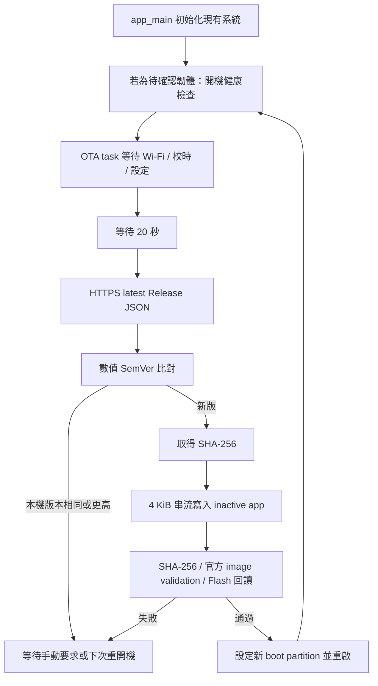

# GitHub Releases OTA（v1.2.1）

## 實際行為

**每次重新開機，連上 Wi-Fi、取得有效時間與設定後，等待 20 秒，自動檢查一次；有較新版本就安裝。** 檢查失敗會保留目前韌體及功能，下次開機或手動呼叫 API 才再試。尚未取得網路／SNTP 時等待 EventGroup，不查詢 GitHub。

公開來源為 `jonas7414/salary_clock`，API 為 `https://api.github.com/repos/jonas7414/salary_clock/releases/latest`。裝置不使用 GitHub PAT。PSRAM 組態選 `firmware.bin`，明確停用 PSRAM 的組態選 `firmware-no-psram.bin`，不會跨組態取檔。

## 已確認的專案條件

| 項目 | 實際值 |
| --- | --- |
| Board | PlatformIO `lilygo-t-display-s3`，ESP32-S3 |
| Flash | Board JSON 的 `upload.flash_size = 16MB`，專案 override 相同 |
| PSRAM | 預設 Octal PSRAM；另有 `tdisplay_s3_no_psram` |
| 建置 | PlatformIO Core 6.2.0、espressif32 6.12.0、ESP-IDF 5.5.0 |
| 系統 | FreeRTOS 1000 Hz，Wi-Fi 事件／EventGroup，獨立 LCD、按鍵、薪資、時間 tasks |
| 原分區 | NVS `0x9000/0x6000`，PHY `0xf000/0x1000`，factory `0x10000/0x400000` |
| 原韌體 | PSRAM 1,058,128 bytes；無 PSRAM 1,047,904 bytes |
| 持久化 | NVS `salary_thief/config`，magic、size、CRC32、AppConfig version 1 |
| Storage | 沒有掛載檔案系統，也沒有 SD task；預留 storage 尚未使用 |
| Watchdog | Interrupt WDT 300 ms；Task WDT 5 秒監看兩核心 idle，新增 panic/reset |

建置前會讀取實際 board configuration，檢查容量、分區對齊、重疊、A/B 槽大小及原 NVS 位置。容量改變時不能只修改分區表而跳過檢查。

## 分區配置與首次 USB 安裝

| 名稱 | 類型 | Offset | Size | 用途 |
| --- | --- | ---: | ---: | --- |
| bootloader | 系統 | `0x000000` | 至 `0x008000` 前 | 啟用 rollback 的 bootloader |
| partition table | 系統 | `0x008000` | `0x1000` | 新 A/B 分區表 |
| nvs | data/nvs | `0x009000` | `0x6000`（24 KiB） | 保留舊設定位置與大小 |
| phy_init | data/phy | `0x00f000` | `0x1000` | PHY |
| otadata | data/ota | `0x010000` | `0x2000` | 兩個 sector 的開機選擇資訊 |
| ota_0 | app/ota_0 | `0x020000` | `0x400000`（4 MiB） | A |
| ota_1 | app/ota_1 | `0x420000` | `0x400000`（4 MiB） | B |
| storage | data/spiffs | `0x820000` | `0x7e0000` | 保留，未掛載 |

結束位置為 `0x1000000`，符合 board 的 16 MB。`0x12000..0x1ffff` 是 app 對齊留白。

舊版沒有 OTA，且使用不同分區表，所以**第一次必須用 USB 完整安裝 bootloader、partitions、otadata 與 app**，不能只把新的 `firmware.bin` 寫到舊 factory offset。正常 PlatformIO Upload 會寫入這四項，不會寫入 `0x9000..0xefff` 的 NVS。不要使用 erase-flash 或 erase-all。

1. 確认板型、序列埠及可用 USB 恢復方式。建議先把 NVS 讀出備份到本機安全位置；备份含 Wi-Fi 密碼，不要加入 Git。
2. 執行 `pio run -e tdisplay_s3`（無 PSRAM 板選對應 environment）。
3. 執行 `pio run -e tdisplay_s3 -t upload --upload-port COM5`，請把 COM5 換成實際序列埠。這一步會更換板上程式。
4. `pio device monitor -p COM5 -b 115200`，確認版本與 `version.txt` 一致、Wi-Fi 與原有設定正常。若沒有有效設定，先完成 Setup。
5. 新 partition table 的首次 USB 安裝沒有可回退的新分區副本；從下一次成功 OTA 開始，才有「前一版」可回滾。首次 USB 過程中斷請用 USB 重新安裝。

本次沒有執行燒錄、清除 Flash 或任何 eFuse 操作。

## 架構與模組責任



| 檔案／模組 | 責任 |
| --- | --- |
| `version.txt` | 唯一正式韌體版本來源，現為 1.2.1 |
| 根 `CMakeLists.txt`、`tools/configure_build.py` | 注入 ESP app descriptor 與 `APP_FIRMWARE_VERSION`，驗證 board／分區，確保既有 sdkconfig 啟用 OTA 必要項 |
| `components/ota_manager/include/ota_config.h` | Repository、組態資產名、開機延遲、健康期、timeout、緩衝區限制 |
| `ota_policy.cpp/.h` | SemVer、Release JSON、SHA 檔案格式及 HTTPS host 白名單；可直接做主機測試 |
| `ota_transfer.h` | 共用串流驗證順序；只有完整下載、digest 與 image 驗證通過才呼叫 activation |
| `ota_manager.cpp/.h` | FreeRTOS worker、HTTPS、redirect、狀態、callback、官方 OTA API、開機驗證 |
| `components/app_core/include/task_health.h` | 任務 heartbeat 與連續穩定期間政策 |
| `app_system` 與五個現有 task | 同步 health 狀態，OTA priority 1，低於現有關鍵 task |
| `app_config`、`app_types` | 保留 NVS、OTA／設定寫入互斥、讀回驗證與 RAM-only migration hook |
| `tools/release_tools.py` | Tag／descriptor／sdkconfig／分區／容量檢查，輸出 bin、SHA-256、建置報告 |
| `.github/workflows/release.yml` | 雙組態建置、測試、草稿上傳完成後發布 Release |

另修改 `src/main.cpp`／`src/CMakeLists.txt` 以啟動 OTA、`platformio.ini`／`sdkconfig.defaults`／`partitions.csv` 以啟用 A/B。測試新增 `tests/test_ota.cpp`、`tests/test_release_tools.py`，擴充 `tests/test_nvs.cpp`、host stubs 與 `tools/test_host.py`；README、驗證報告同步更新。

### 更新順序

1. Worker 等待三個 EventGroup bit，開機只自動檢查一次；手動要求透過長度 4 的 queue 序列化。
2. API JSON 最多 32 KiB、最多 12 層，依鍵名找 stable tag 與對應資產，拒絕草稿、prerelease、重複鍵、重複資產、非法大小／URL／版本。
3. 數值比對 major/minor/patch；`v` 可省略，正確處理 1.9.0 < 1.10.0。解析器也支援 SemVer prerelease precedence 與忽略 build metadata，但自動安裝只接受 stable Release。
4. SHA 來源為 GitHub asset 的 `digest` 或同 Release 的 `.sha256`。兩者存在時必須一致。發布流程固定產生 checksum；兩者皆缺少會拒絕安裝。
5. 驗證 inactive partition、容量與故障版本紀錄，先讀 app header／descriptor 確認 ESP32-S3、專案名稱、tag 版本，再開始擦寫。
6. 使用 `esp_http_client` 加憑證 bundle；手動處理最多 5 次 redirect。每一跳只接受 GitHub 指定 HTTPS hosts，禁止 HTTP downgrade、自訂 port、userinfo 或外部 host。CDN 簽名 URL 不寫入 OTA log。
7. 每次最多 4096 bytes，使用 `esp_ota_begin(..., OTA_WITH_SEQUENTIAL_WRITES, ...)` 漸進擦除，再 `esp_ota_write`，同時計算 SHA。每批讓出 CPU，避免長時間一次擦除整個槽。
8. 完整長度與 SHA 相符後呼叫 `esp_ota_end()` 做官方 ESP image validation，接著從 Flash 讀回再比 SHA。
9. 所有驗證完成才呼叫 `esp_ota_set_boot_partition()`，發布 SUCCESS／READY_TO_REBOOT，釋放資源後重啟。

採用細部官方 API 而不是單次 `esp_https_ota()`，是為了在 boot partition 切換前比對 Release SHA、回讀 Flash，並逐跳限制 HTTPS redirect。TLS、HTTP、映像解析驗證與 otadata 寫入仍由 ESP-IDF 處理。

### Rollback 順序

啟用 `CONFIG_BOOTLOADER_APP_ROLLBACK_ENABLE=y`。新映像第一次由 bootloader 設成 `PENDING_VERIFY`；OTA worker 在任何網路檢查前做 probation：

- 讀回 NVS，檢查 CRC、record layout 與 config version。
- 確認 Wi-Fi subsystem 已啟動、設定有效；不把外部 AP／Internet 暫時故障當成韌體失敗。
- LCD、按鍵、薪資、時間、Wi-Fi 五個 task 的 heartbeat 都必須在 3 秒內更新，持續健康至少 30 秒。
- 90 秒內無法達到穩定，或出現 SYSTEM_ERROR／NVS failure，呼叫 `esp_ota_mark_app_invalid_rollback_and_reboot()`。
- Probation worker 加入 5 秒 task watchdog；阻塞／reset 在尚未標記 valid 時會由下一次 bootloader 回退。
- 通過後才 `esp_ota_mark_app_valid_cancel_rollback()`，解除該 worker 的 WDT 訂閱，再允許 OTA 檢查。

目前 storage 未掛載，因此沒有假裝做 filesystem self-test。未來加入檔案系統或 SD 時，必須把初始化結果及其 task heartbeat 加入健康條件。main 初始化期間也訂閱 5 秒 task watchdog，避免 initializer 永久卡住；初始化完成後解除，接由 probation worker 檢查。`ESP_ERROR_CHECK` 失敗會 reset；更早期 bootloader／晶片故障仍須按下列實板測試確認。

回滾後讀取 `esp_ota_get_last_invalid_partition()`；若 latest 正是該失敗版本，不會再次安裝。應發布較高版本修正，不能沿用故障 tag 覆蓋資產。

## API 與併行

```cpp
#include "ota_manager.h"
ota_check_update();                 // 只檢查，不安裝；非阻塞
ota_start_update();                 // 重新取得 metadata，僅安裝較新版
const char *current=ota_get_current_version();
OtaStatus snapshot=ota_get_status(); // 含 latest_version、HTTP code、error、message
OtaState state=ota_get_state();
bool available=ota_is_update_available();
```

`ota_init()` 由 main 在現有 task 建立後呼叫一次。尚未初始化或 queue 已滿時要求會回傳 `ESP_ERR_INVALID_STATE`。離線的手動要求在連線／校時完成後執行。`latest_version` 以 snapshot 複製，避免跨 task 共用可變字串指標。

`ota_set_callback(fn, context)` 提供 START／PROGRESS／VERIFY／SUCCESS／FAILED。Callback 在 OTA worker 執行，必須快速返回；可將 snapshot 放入 UI queue，不可直接做長時間 LCD 工作。進度包含 downloaded_bytes、total_bytes、percentage；下載 100% 不代表驗證成功，請看 state。

OTA 不依賴 display／Web／CLI。現有產品沒有新增未完成的按鈕或 CLI；未來從各介面呼叫上述 API 即可。

下載期間 app_config maintenance mutex 阻止 save/reset，snapshot 讀取保持可用；`OTA_ACTIVE_BIT` 阻止新的 setup/reboot/reset 命令。已排入的命令遇到 reset 鎖衝突會記錄錯誤，不會用 assertion 造成意外重啟。任意實體斷電仍按 A/B 原理保留正在執行的 app。

錯誤包含斷線、DNS／TLS／HTTP 403/404/429/500、缺 Release／資產、JSON／版本異常、長度／SHA／映像不符、容量不足、Flash 操作失敗；進入 ERROR、abort 未完成 handle、清理 client／heap／mutex，保留目前 app。網路錯誤不設 SYSTEM_ERROR、不主動 reboot。Socket timeout 10 秒，metadata 作業期限 60 秒、下載期限 10 分鐘，於每段 I/O 檢查。沒有 tight retry loop。

Worker stack 12 KiB，metadata／TLS／4 KiB buffer 在 heap；檢查前後記錄 free heap、minimum heap 與 stack watermark。實際最低剩餘記憶體及 LCD FPS 仍需雙組態實測。

## NVS 相容性

不改原 NVS offset、size、namespace 或 config record。NVS 初始化若回報 no-free-pages／new-version，現在回傳錯誤且保留資料，不會自動 erase；待確認的 OTA 韌體因初始化失敗 reset 時可回滾。

`AppConfig::version`／`CONFIG_VERSION` 為 schema 版本，與韌體版本分開。`config_migrate()` 目前只接受既有 v1，未知 schema 保留原 blob 並拒絕載入。未來增加 schema 時，先增加舊 record 大小／CRC decoder，再於 hook 逐版轉成 RAM representation；不要在 probation 自動覆寫原 NVS。需要持久化新 schema 時應採新 key／雙版本紀錄，並確保上一版仍可讀，否則回滾程式可能失去設定。版本檢查不等於已有未知 schema 的轉換實作。

## Release 與第一次發布

`.github/workflows/release.yml` 在推送 `v*` tag 時啟動。可用 workflow_dispatch 做不發布的建置。Build jobs 只有 contents:read；publish job 使用 Actions 自動提供的 `GITHUB_TOKEN` 與 contents:write，Token 不傳入 firmware build。

順序：checkout → Python 3.12 → PlatformIO 6.2.0 → tag 與 version.txt 一致性 → host/release guards → 兩種環境 build → 驗證 descriptor、TLS／rollback／PSRAM 組態、實際 partition binary 與 firmware size → SHA-256 → 合併 artifacts → 再驗 SHA → 建草稿 Release → 上傳完整四檔 → 公開設為 latest。

草稿在所有檔案上傳前不會成為裝置的 latest。已存在同名 Release 時流程會失敗，不覆蓋已發布映像；若前次因上傳中斷留下草稿，確認內容後刪除該未發布草稿再 rerun。不得刪除已發布版本來重用 tag。

第一次先完成上述 USB 安裝與實板驗收，接著提交程式並推送 tag：

```sh
git add .
git commit -m "Add boot-time GitHub OTA with rollback"
git push origin main
git tag v1.2.1
git push origin v1.2.1
```

測試 v1.2.1 OTA 時，裝置應先安裝支援 OTA 的 1.2.0，再重新開機檢查。若已透過 USB 安裝 1.2.1，看到相同版本會跳過更新；下一次測試需發布更高版本，例如 1.2.2。沒有 OTA 的舊版必須先完成 USB 安裝，不能直接接收 Release 更新。

Release 必須有 `firmware.bin`、`firmware.sha256`、`firmware-no-psram.bin`、`firmware-no-psram.sha256`。只發布 app binary，bootloader／partition table 不透過此 OTA 改寫。Release notes 不宜過長，以免完整 API JSON 超過 32 KiB。

## 驗證結果與實板測試計畫

本機雙組態 `pio run` 已成功；C++ host tests 共 1,540,172 檢查（包含 OTA 242 項、NVS 29 項），另有 3 組 Python release guard 測試。Tag 必須與 `version.txt` 一致，不相符的版本會被拒絕。數值與本機產物 SHA 見 [build-results.json](build-results.json)；公開產物以 Release 附帶的 SHA 為準。CI 結果見 [GitHub Actions](https://github.com/jonas7414/salary_clock/actions/workflows/release.yml)。裝置端 TLS、斷電與回滾仍需實板確認。

| 組態 | firmware.bin | OTA slot | 剩餘空間 |
| --- | ---: | ---: | ---: |
| PSRAM | 1,242,864 bytes | 4,194,304 bytes | 2,951,440 bytes |
| 無 PSRAM | 1,232,832 bytes | 4,194,304 bytes | 2,961,472 bytes |

主機測試直接使用 production SemVer、cJSON parser、checksum／URL policy、probation 與串流順序。故障注入涵蓋每個讀取邊界中斷、短讀、過長、write／digest／image／activation 失敗，檢查前序失敗時 activation 未呼叫；這不替代實際 Flash／bootloader 的斷電保證。

在可用 USB 復原的測試板上，先確認兩版都有相同 A/B 表、啟用 rollback、保留 NVS，兩種組態各跑一輪。破壞性測試用獨立公開測試 repository（改 ota_config 的 REPOSITORY 後以 USB 安裝測試 build），不要向正式裝置發布故障映像。

| 情境 | 操作與預期 |
| --- | --- |
| 相同／較舊版 | 板 1.2.0，latest 1.2.0 或 1.1.0；重啟後只查一次，IDLE，無擦寫／重啟 |
| 新版成功 | 板 1.2.0，latest 1.2.1；重啟、等待網路／20 秒，下載→驗證→重啟，確認版本、slot 切換、30 秒後 valid、原設定不變 |
| 單次策略 | API 失敗後恢复網路但不重啟，確認無自動再次 HTTP 查詢；重啟才再次檢查。手動 API 可立即排隊 |
| 下載斷電 | 分別在約 30%、99% 拔電，重開仍是原版；繼續正常 LCD／按鍵／薪資操作，下一次開機可重新下載 |
| 切換後斷電 | 在 READY_TO_REBOOT 後與新板 probation 中斷電，檢查 bootloader 選擇有效舊版／完成回滾，NVS 未改 |
| 損毀映像 | 在測試 Release 改動 binary 的一 byte，保留原 SHA；拒絕更新，boot partition 不變；另外改 SHA 配合但破壞映像內容，應由 ESP image validation 擋下 |
| 故障新版 | 在測試新版 probation 前故意 abort，或停止 LCD heartbeat；應 reset／90 秒內回滾，舊版看到相同故障版本不反覆下載 |
| OTA 中 Wi-Fi 斷線 | 下載中關 AP，應 ERROR／abort；舊版繼續執行，網路不可用時沿用原 Wi-Fi fallback policy |
| GitHub／DNS／TLS 失敗 | 用路由器 DNS／防火牆阻擋 GitHub、封鎖 SNTP，分別確認 ERROR 或等待有效時間，無更新造成的 reboot |
| HTTP 錯誤 | 測試來源不存在（404）、受限（403/429）、服務錯誤（500）時只記錄與保留 app；不能以停用 TLS 的代理測試取代驗證 |
| 版本／JSON／資產 | 測試 tag 非法、檔名錯、無 SHA、兩個 SHA 不同、過大 asset、不同專案映像，均拒絕且不切 slot |
| Redirect | 正常 GitHub→CDN 能下载；host lookalike、HTTP downgrade、循環或超過 5 跳拒絕；URL policy 已由 host tests 覆蓋 |
| NVS／併行 | 下載中呼叫 save/reset 應拒絕，snapshot 仍可讀；斷線／完成後 maintenance lock 可重新取得 |
| 記憶體／watchdog | 反覆手動檢查／網路失敗，觀察 heap 無持續下滑，LCD／按鍵可用；無 PSRAM 重點確認 TLS 峰值與 task stack |

## 安全與未來擴充

現在提供 HTTPS chain／hostname 驗證、GitHub host 限制、版本／專案／chip 比對、SHA-256、ESP-IDF 映像驗證與 A/B rollback。`sdkconfig.defaults` 啟用憑證 bundle、HTTPS、rollback、WDT panic；產物檢查拒絕 insecure TLS。未啟用 Secure Boot、Flash Encryption 或 eFuse anti-rollback。

SHA 同樣由 GitHub 供應，能檢查下載一致性，但不能防止 GitHub 帳號／發布權限被攻破後連映像及 SHA 一起更換。應保護 repository 管理權、tag／Release 權限與 Actions 供應鏈，定期維護憑證 bundle。

下一階段可先設計 signed firmware／離線金鑰與 CI 簽署程序，保留目前 `esp_ota_end` 驗證關卡；再獨立規劃 Secure Boot V2、Flash Encryption 與 secure_version anti-rollback。需要重新評估簽名區大小、加密寫入對齊、回讀 hash、金鑰保管、USB 恢復與舊版 schema 相容性。一般 SemVer 禁止降版不是 eFuse anti-rollback。

**DO NOT ENABLE ON DEVELOPMENT DEVICE WITHOUT REVIEW**。Secure Boot／Flash Encryption／anti-rollback 可能寫入不可逆 eFuse；本次未啟用也未執行相關操作。未來加入前需獨立審查並取得明確授權。

官方依據：[ESP-IDF 5.5 OTA／rollback](https://docs.espressif.com/projects/esp-idf/en/v5.5/esp32s3/api-reference/system/ota.html)、[HTTPS OTA API](https://docs.espressif.com/projects/esp-idf/en/v5.5/esp32s3/api-reference/system/esp_https_ota.html)、[GitHub Releases REST](https://docs.github.com/en/rest/releases/releases)、[GitHub asset digest](https://github.blog/changelog/2025-06-03-releases-now-expose-digests-for-release-assets/)、[Actions GITHUB_TOKEN](https://docs.github.com/en/actions/tutorials/authenticate-with-github_token)。
