# 薪水小偷計算器｜使用手冊

把裝置放上桌、設定自己的薪資與作息，就能看見今天的工作進度。這份手冊從已安裝韌體的裝置開始，適用於目前 v1.4.7 的操作介面；版本來源為 [version.txt](../version.txt)。尚未安裝韌體，請先參考 [README 的建置與燒錄說明](../README.md#給開發者)。

[第一次使用](#第一次使用) · [按鈕速查](#按鈕速查) · [認識八個頁面](#認識八個頁面) · [修改設定](#修改設定) · [亮度與睡眠](#亮度與睡眠) · [收入計算](#收入與休假如何計算) · [韌體更新](#韌體更新) · [常見問題](#常見問題)

**看圖方式**：以下裝置畫面由目前韌體的實際繪圖程式產生，採用示例時間、薪資與網路資料；不是實機照片。圖中的 Wi-Fi 名稱、日期與金額請以自己的裝置為準。多數圖片採「經典原版」，其他風格的操作相同。

## 第一次使用

### 準備與擺放

準備原版 **LILYGO T-Display-S3（1.9 吋 ST7789 螢幕）**、USB-C 電源、一支能使用瀏覽器的手機，以及有網際網路連線的 **2.4 GHz Wi-Fi**。將螢幕橫放、USB 接口朝左；本文所稱的「上方按鈕／下方按鈕」都以此方向為準。

### 用手機設定

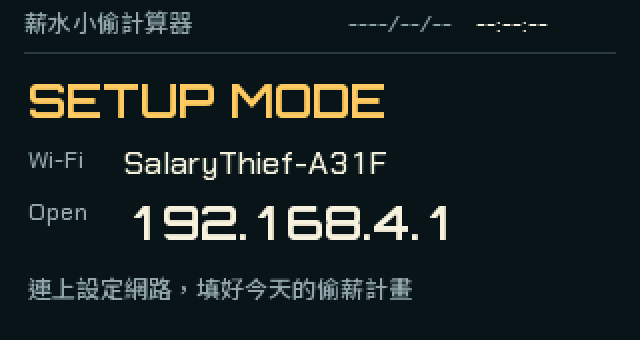

**圖 1｜先找螢幕上的 Wi-Fi 名稱。** 圖中 `SalaryThief-A31F` 是示例；手機要連上自己螢幕顯示的名稱，再開啟 `http://192.168.4.1`。

1. 接上電源。開機會播放約五秒金幣動畫，並顯示韌體版本。
2. 首次使用時，螢幕會顯示設定模式與 `SalaryThief-XXXX`。在手機 Wi-Fi 清單選擇同名網路，無須密碼。
3. 手機若顯示「沒有網際網路」，選擇保持連線。這個 Wi-Fi 是用來設定裝置的。
4. 開啟瀏覽器，輸入 **http://192.168.4.1**。使用 `http://`，不要改成 `https://`。
5. 在「網路」掃描或輸入家中／辦公室 Wi-Fi 名稱，再輸入密碼。請使用 2.4 GHz 網路。
6. 在「薪資與工時」填入月薪、自己的到職日、上下班及午休時間；在「時間」確認時區。
7. 按頁面下方的「儲存並重新開機」。成功後查看裝置螢幕；設定 Wi-Fi 會關閉，手機可切回平常的網路。
8. 裝置連線並取得有效時間後，開始顯示薪資畫面。沒有硬體時鐘時，開機需等待網路校時。

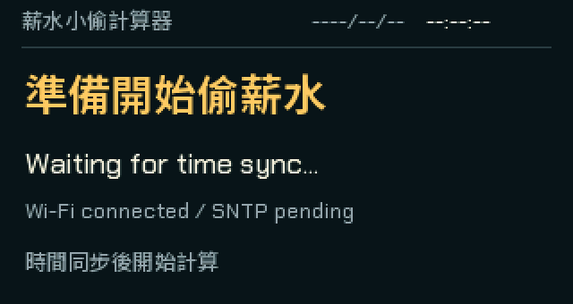

**圖 2｜連線完成後，還要取得時間。** 看到校時等待畫面時，先讓裝置保持連網；取得有效時間後會進入薪資頁面，不需要再按一次儲存。

看到「設定已儲存。請按『重新開機』套用設定。」時，代表設定已保存；請按「系統」中的「重新開機」完成套用。

### 第一次要確認的預設值

| 項目 | 預設值 | 建議確認 |
| --- | --- | --- |
| 月薪 | NT$40,000 | 改成想用來估算的整數月薪 |
| 到職日 | 2026-08-01 | 改成自己的日期，會影響到職累積 |
| 上下班 | 09:00–18:00 | 同一天內的工作時段 |
| 午休 | 12:00–13:00 | 午休時間不累計收入 |
| 時區 | Asia/Taipei | 台灣使用者可維持預設 |
| 螢幕時段 | 08:00–19:00 | 每天皆適用，包含假日 |
| 螢幕風格／亮度 | 經典原版／100% | 可依桌面光線調整 |

工時必須符合 **上班 < 午休開始 < 午休結束 < 下班**。目前無法設定跨午夜班別或零分鐘午休。

## 按鈕速查

### 一般看時間與翻頁

| 操作 | 會發生什麼 |
| --- | --- |
| 短按上方按鈕 | 上一頁 |
| 短按下方按鈕 | 下一頁；約等 0.4 秒判斷是否雙擊 |
| 快速連按下方按鈕兩下 | 進入手機設定模式；兩次之間放開的間隔須小於 0.4 秒 |
| 按住下方按鈕 5 秒，然後放開 | 關屏並進入深度睡眠 |
| 深度睡眠時按住下方按鈕約 5 秒 | 喚醒並重新開機；提早放開則繼續睡眠 |
| 在「系統資訊」長按上方按鈕 2 秒 | 手動檢查韌體更新 |
| 在「亮度調整」長按上方按鈕 2 秒 | 進入亮度編輯 |

下方按鈕按住 0.5 秒以上、未滿 5 秒就放開，會取消睡眠，不翻頁或進入設定。長按按鈕不會清除設定。喚醒計時從韌體啟動開始，因此實際可能需要按住略長於五秒；一般開機時請放開上方按鈕，以免進入下載模式。

### 特殊畫面中的操作

| 畫面 | 上方按鈕 | 下方按鈕 |
| --- | --- | --- |
| 亮度「調整中」 | 短按調暗；長按 2 秒儲存並結束 | 短按調亮；此時不進入設定或睡眠 |
| 發現新韌體的提示 | 短按切換選項 | 短按確認選項 |
| 正在下載／安裝韌體 | 等待更新完成 | 等待更新完成，暫停一般翻頁與睡眠操作 |

## 認識八個頁面

下列是全新設定的預設順序。升級後可能保留你的舊順序，新增頁面則出現在尾端；可在手機設定頁調整。

此圖由實際韌體繪圖程式產生，日期、薪資及系統資訊均為示例，不是裝置即時狀態。

| 頁面 | 你可以看什麼 |
| --- | --- |
| **今日偷薪** | 今天已賺到的金額、工作狀態與進度。金幣依工時逐枚增加、午休看漢堡、下班保留滿金幣，假日是海灘場景 |
| **還能偷多少** | 今天剩下可賺的金額，以及扣除午休後的剩餘工作時間 |
| **本月戰績** | 設定的月薪、本月工作日與總工時，以及每日／每小時／每分鐘／每秒費率；這頁不是本月實領薪資帳本 |
| **這份工作撈多少** | 依目前月薪與排程，估算從到職日起至今的累積收入 |
| **現在時刻** | 大字時間、日期、星期與兩位小數秒；下方輪播紀念日，未設定時顯示小雲朵 |
| **休假倒數** | 距離下一個非工作日的天數、小時、總小時與進度；資料完整時也會顯示休假總天數 |
| **亮度調整** | 查看目前亮度，透過按鈕調整並儲存 |
| **系統資訊** | 查看 Wi-Fi、IP、校時、硬體時鐘、供電、版本及更新狀態，方便排查問題 |

上班、午休開始、午休結束、下班與進入假日的交界，可能短暫播放放大文字動畫，再回到原本頁面；不是按鈕失靈。

## 修改設定

正常使用時快速連按下方按鈕兩下，重新連上螢幕顯示的 `SalaryThief-XXXX`，再開啟 **http://192.168.4.1**。設定頁的修改，按「儲存並重新開機」後才套用。

### 網路

掃描附近 Wi-Fi 或直接輸入名稱。若仍使用原本的網路，可勾選「保留既有密碼」；要更改密碼，取消勾選再輸入。更換 Wi-Fi 名稱時須提供新網路密碼；開放式網路可留空。

設定網頁僅在連上裝置的設定 Wi-Fi 時使用，不需要註冊帳號。無須讓手機一直連著裝置，完成設定即可離開。

### 薪資與工時

填入整數月薪、到職日、上班、下班、午休開始與結束時間。月薪接受 NT$1–1,000,000,000；日期接受 1900–2199 年，但能選擇某年不代表已有該年的工作日資料。

工作日依台灣政府行事曆，無須勾選星期。修改月薪或工時後，今日收入與到職累積都會重新估算，不保留舊薪資分段紀錄。

### 螢幕

選擇「經典原版」「琥珀終端」或「復古掌機」，三種風格都支援八個頁面。[查看完整風格對照](themes.png)。

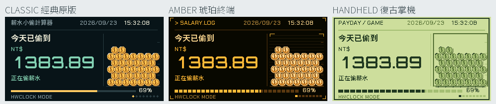

**圖 3｜選擇喜歡的配色。** 左至右為經典原版、琥珀終端、復古掌機；切換風格不會改變薪資設定與計算方式。

「自動開關」設定每天亮屏時段。預設 08:00 開啟、19:00 關閉；可設定跨午夜，例如 18:00 開啟、01:00 關閉。**開啟與關閉時間相同，表示全天開啟。**

### 頁面順序

拖曳頁面，或使用 ↑ ↓ 移動。「恢復預設順序」可還原排列，仍須儲存才生效。重開機後會先顯示排列中的第一頁，因此可把「現在時刻」放在最前面。

### 紀念日

1. 按「新增紀念日」。
2. 填入名稱與日期，例如「生日」或「旅行出發」。最多五個項目，名稱最多 24 字，建議使用短名稱；不支援 emoji。
3. 每年都要提醒的日子勾選「每年重複紀念」；一次性的目標日期則取消勾選。
4. 儲存並重新開機，切到「現在時刻」，每五秒會換下一個已設定的項目。

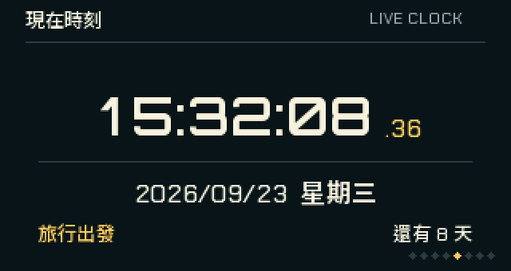

**圖 4｜紀念日會出現在時間下方。** 示例把「旅行出發」設為 2026/10/01，在 2026/09/23 顯示還有 8 天；設定多個項目時，此區每五秒換一個。

畫面會顯示「還有 X 天」「就是今天」或「已經 X 天」。每年重複會倒數下一次紀念日；2 月 29 日在平年以 2 月 28 日計算。這是日期顯示功能，沒有鬧鐘提醒。

想移除時按該項的「刪除」，再儲存。名稱與日期要成對填寫，不能只留其中一個。

### 時間

可選時區為 Asia/Taipei、Asia/Tokyo、Asia/Hong_Kong、Asia/Singapore 或 UTC。工作時段、螢幕開關與日期顯示都依所選時區，工作日仍採台灣行事曆。

NTP 伺服器可選 `pool.ntp.org` 或 `time.cloudflare.com`；裝置優先使用所選項目，另一個作為備援。一般維持預設即可；若網路已連線卻一直無法校時，可切換後重試。

### 系統

- **重新開機**：重啟裝置，保留已儲存設定；未儲存的表單修改不會套用。
- **清除設定並重設**：確認後清除 Wi-Fi 與所有已存設定，回到首次設定流程。只在確定要重新設定整台裝置時使用。
- **診斷資訊**：展開可查看版本、網路、時間與行事曆等狀態，適合排查問題時提供參考。

韌體更新要結束設定模式後，在裝置「系統資訊」頁操作。

## 亮度與睡眠

### 調整亮度

1. 翻到「亮度調整」。
2. 長按上方按鈕 2 秒，看到「調整中」後放開。
3. 短按上方按鈕調暗，短按下方按鈕調亮；範圍 10%–100%，每次 10%。
4. 再長按上方按鈕 2 秒儲存，看到「已儲存」後恢復一般翻頁。

| 調整時 | 儲存後 |
| --- | --- |
| 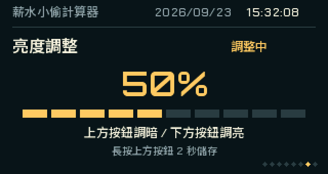 |  |

**圖 5｜看右上角確認是否完成。** 左圖「調整中」可用上方按鈕調暗、下方按鈕調亮；長按上方按鈕 2 秒，變成右圖「已儲存」才完成。圖中 50% 是示例。

調整時螢幕保持亮起，下方按鈕不會進入設定或睡眠。若顯示「儲存失敗」，保持此頁並再次長按上方按鈕 2 秒重試；未成功儲存前，不要把新亮度視為已保存。

### 關屏與深度睡眠有什麼不同

| 狀態 | 時鐘與網路 | 如何恢復 |
| --- | --- | --- |
| 到了每天關屏時間 | 繼續運作與計算，只關閉顯示與背光 | 到開屏時間自動亮起；按下方按鈕可暫時亮起 5 分鐘 |
| 長按進入深度睡眠 | 停止網路與計算，保留已存設定 | 按住下方按鈕約 5 秒喚醒；不會因每天開屏時間到而自行開機 |

夜間再次按下方按鈕會重算五分鐘，若期間已到每日開屏時間，則持續亮屏。尚未取得有效時間、設定模式、開機動畫與韌體更新等需要操作或提示的狀態，螢幕會保持亮起。

深度睡眠後的收入會依恢復時取得的時間重新計算，並不是把睡眠期間永久扣掉。沒有有效 RTC 時，喚醒後需要網路校時。

## 收入與休假如何計算

### 今日收入

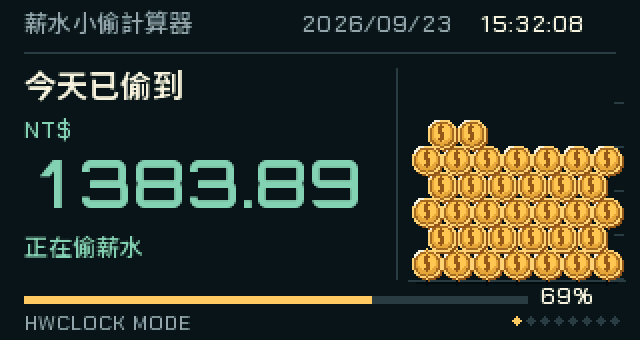

**圖 6｜大字是今日累積，底部是工作進度。** 示例工作到 15:32:08，已累計 NT$1,383.89；右側金幣是工作中的動畫，下方狀態文字可辨識是否正在計薪。

右側一天最多累積 **52 枚小金幣**，每枚代表「當日有效工時 ÷ 52」。枚數依已完成工時向下取整，與月薪高低無關；午休暫停累積，下班時才出現最後一枚，並保留滿金幣畫面。

以 09:00–18:00、午休 12:00–13:00 為例，有效工時是 8 小時，約每工作 9 分 14 秒新增一枚。11:00 是 13 枚，14:00 是 26 枚，16:00 是 39 枚，18:00 集滿 52 枚。未上班與休假日不累積；重新開機、喚醒或校時後會按目前有效時間還原進度。

**工時對照｜從空盤慢慢累積到滿盤。** 由上而下為 0%、25%、50%、75%、100%；左至右為三種風格。這些是各時點的畫面對照，實際使用時只在跨過下一枚的工時門檻才掉幣。

裝置把月薪依當月工作日及每天的有效工時分配。假設月薪 NT$40,000，當月 20 個工作日，每日工作 8 小時：

| 項目 | 結果 |
| --- | --- |
| 每工作日 | NT$2,000 |
| 每小時 | NT$250 |
| 每分鐘 | 約 NT$4.17 |
| 每秒 | 約 NT$0.0694 |

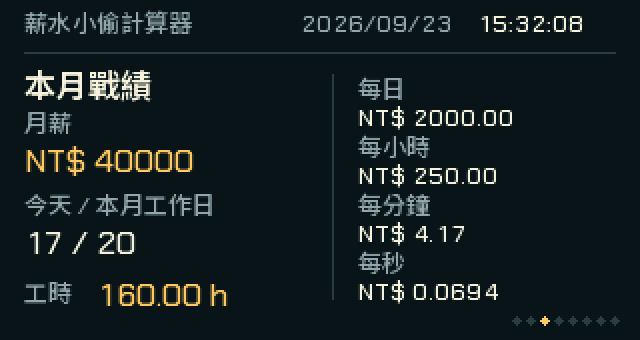

**圖 7｜在「本月戰績」核對計算基礎。** 左側顯示月薪、本月工作日與工時，右側顯示各時間單位的費率；圖中的「17 / 20」是今天的工作日序號／本月工作日總數。

上班前今日收入為零；工作期間增加；午休暫停；下班後停在當日上限；休假日為零。每日金額會隨各月工作日數改變。重新開機會按目前時間重算，不會從開機那一秒才開始賺。

這些金額是依排程的估算，不計打卡、請假、加班、扣款或實際匯款，適合觀察工作進度。

### 到職累積

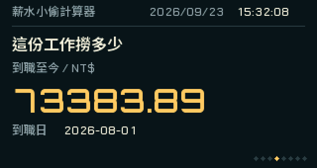

**圖 8｜先核對金額下方的到職日。** 示例從 2026/08/01 累計到畫面當下，得到 NT$73,383.89。日期不對時，到手機設定頁的「薪資與工時」修改。

「這份工作撈多少」將到職日起每個月的工作時間，按**目前設定的月薪與工時**累計到現在。更改月薪會重算整段期間，無法分別記錄每次調薪。到職日設在未來時，累積為零。

目前韌體內建 2026–2027 年行事曆，下載快取保留兩個年度，並非永久歷史紀錄。如果到職期間缺少任何必要年度的資料，裝置會提示缺資料，避免顯示不完整金額；重新設定很早的到職日不會自動下載所有歷史年份。

### 休假倒數與行事曆

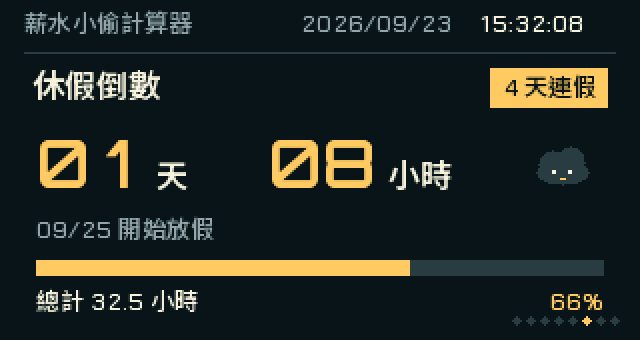

**圖 9｜大字看倒數，右上角看連假長度。** 示例距 09/25 開始放假約 1 天 8 小時，底部提供總計 32.5 小時；「4 天連假」是整段休假長度，不是剩餘工作天數。

倒數終點是所選時區中**下一個非工作日的 00:00**，不是前一天的下班時間。進度從本段連續工作日的第一天 00:00 開始，包含下班後的時間。已在休假時顯示「休假進行中」，三天以上連休會標示連假；顯示的是整段休假的總天數。

行事曆包含週末、國定假日及補班日。裝置開機滿一分鐘、連上 Wi-Fi 並完成網路校時後，會嘗試更新今年與明年的資料，之後每天最多檢查一次（以 UTC 日期為準）。下載失敗時保留既有資料，重新開機不會重設當天檢查次數。

顯示「行事曆待更新」表示目前沒有該年度資料；時間仍繼續走，但薪資計算暫停。連假邊界資料不完整時，不會猜測連假天數。

## 離線使用與供電資訊

### 沒有 Wi-Fi 時

本次開機已取得有效時間後，即使 Wi-Fi 暫時斷線，仍能繼續顯示與計算；行事曆使用已保存或內建資料。若完全斷電再開機，沒有有效硬體時鐘時，需要重新連網校時。

選配 **DS3231 硬體時鐘（RTC）** 可在斷電後保存時間，讓已設定的裝置離線開機。先完成一次網路校時，裝置會自動將時間寫入 RTC；之後開機讀取有效時間時會顯示 `RTC READ`／`HWCLOCK READY`，使用硬體時間時主頁可見 `HWCLOCK MODE`。`RTC SYNC`／`RTC SAVED` 則表示網路時間正在寫入／已寫入硬體時鐘。

需要自行加裝時，先斷開電源，再依下表接線；模組須有適用的備援電池與 SDA／SCL 上拉電阻。接好後重新開機，韌體會自動偵測，無須在設定頁啟用。

| DS3231 | T-Display-S3 |
| --- | --- |
| SDA | GPIO43 |
| SCL | GPIO44 |
| VCC | 3.3V |
| GND | GND |

INT/SQW 與 32K 不需接線。RTC 支援 2000–2099 年；電池失效或時間無效時，仍需網路校時。「SNTP 未同步」只代表這次開機尚未完成網路校時，不一定表示 RTC 時間不可用。

### 系統資訊中的 BAT 是什麼

| 推定電池供電 | USB／5V 外部供電 |
| --- | --- |
| 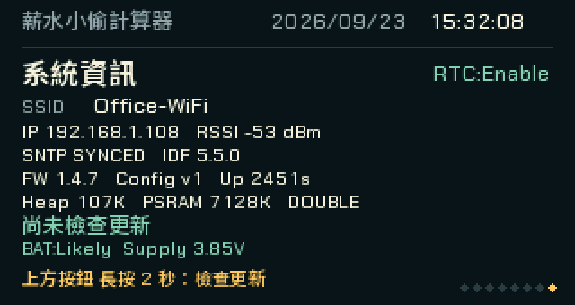 | 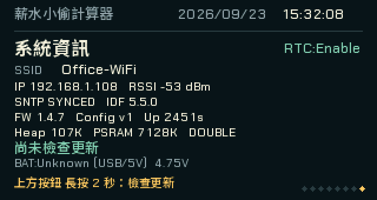 |

**圖 10｜看畫面下方的 BAT 與 Supply。** 左圖推定由電池供電，右圖為外部供電、電池接入狀態未知。上方的 Wi-Fi、SNTP 與版本資訊也可用來排查連線或更新問題。

| 顯示 | 意義 |
| --- | --- |
| `BAT:Checking...` | 開機或切換供電後，正在等待穩定讀值 |
| `BAT:Likely` | 根據供電電壓，推定目前由電池供電 |
| `BAT:Unknown (USB/5V)` | 推定使用外部供電，無法知道是否同時接著電池 |
| `BAT:Unknown`／`Read unavailable` | 暫時無法可靠判斷來源或取得電壓 |

`Supply` 是供電端電壓，不是剩餘電量百分比，也不代表充電中或已充飽。插著 USB 時顯示未知電池狀態，屬正常行為。詳細限制見 [電池說明](battery.md)。

## 韌體更新

每次開機連線並完成校時後，裝置會等待 20 秒檢查一次新版。發現新版時先詢問，預選「稍後」。

**圖 11｜先選擇，再確認。** 用上方按鈕移動選項，再用下方按鈕確認。圖中的 **v1.4.8 僅為模擬版本**，用來說明操作，不代表已公開發布。

1. 用上方按鈕切換「立即更新」「稍後」「此版本不再提醒」。
2. 用下方按鈕確認。選「此版本不再提醒」只略過該版，之後更高版本仍會通知。
3. 選擇更新後維持穩定供電與 Wi-Fi，等待百分比與進度條完成。更新期間一般翻頁、設定與睡眠暫停。
4. 驗證完成後自動重新開機。到「系統資訊」查看版本，已存 Wi-Fi 與薪資設定會保留。

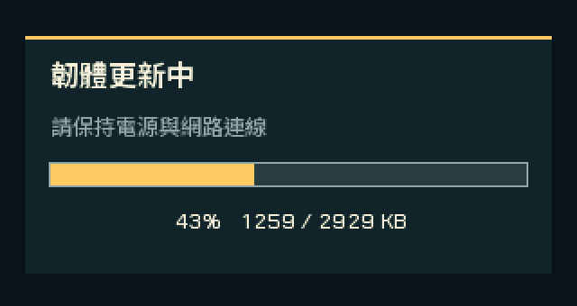

**圖 12｜下載中看百分比與容量。** 圖中 43% 是示例；保持供電與 Wi-Fi，等待下載、驗證及重新開機完成，再到「系統資訊」確認最後版本。

想主動檢查，翻到「系統資訊」，長按上方按鈕 2 秒。手動檢查也能再次顯示先前略過的版本；若顯示失敗，先確認網路與時間，按下方按鈕返回後再試。

更新後有啟動健康檢查，失敗時可回到前一版；請以裝置最後顯示的版本確認結果。使用沒有 OTA 的舊版裝置，需先透過 USB 安裝相容的完整韌體配置，見 [OTA 文件](ota.md)。

## 常見問題

| 遇到的狀況 | 可以怎麼做 |
| --- | --- |
| 手機連上裝置 Wi-Fi 卻說沒網路 | 選擇保持連線，手動輸入 `http://192.168.4.1` |
| 設定網頁開不起來 | 確認裝置正在設定模式，手機仍連著螢幕顯示的 `SalaryThief-XXXX`；避免手機自動切回其他 Wi-Fi |
| 找不到設定 Wi-Fi | 一般模式下快速連按下方按鈕兩下；若正在亮度編輯，先長按上方按鈕儲存退出 |
| 儲存後又回到設定模式 | 核對 Wi-Fi 名稱、密碼及 2.4 GHz 訊號，修正後再儲存重啟 |
| 已連上 Wi-Fi，仍在等待校時 | 確認該網路可上網；在「時間」切換 NTP 伺服器，儲存重啟後再試 |
| 螢幕突然變黑 | 先短按下方按鈕，可能只是排程關屏；若曾長按進入睡眠，則按住約 5 秒喚醒，再檢查電源 |
| 下方按鈕短按有延遲 | 約 0.4 秒是雙擊判斷時間，屬正常行為 |
| 兩個按鈕只會調亮、調暗 | 正在亮度編輯；長按上方按鈕 2 秒儲存後即可翻頁 |
| 午休、下班或假日金額不增加 | 依設定排程暫停；假日今日收入為零 |
| 每月算出的每日薪資不同 | 每月工作日數不同，因此每日分配的金額也不同 |
| 到職累積沒有金額或提示缺資料 | 核對到職日；過去年份可能沒有行事曆，不是清除設定就能補齊 |
| 休假倒數沒有在下班時歸零 | 終點是休假第一天 00:00，不是下班時間 |
| 紀念日無法儲存 | 同時填入名稱與有效日期；名稱不超過 24 字，移除 emoji 或不支援的字元 |
| 電池狀態在 USB 供電時顯示未知 | 供電量測無法辨識是否同時接著電池，屬正常顯示 |
| 沒有新版通知 | 在「系統資訊」長按上方按鈕 2 秒手動檢查，確認網路與有效時間 |
| 想完全重新設定 | 進入手機設定頁，在「系統」按「清除設定並重設」，確認後依首次設定流程操作 |

需要回報問題時，請記下「系統資訊」的韌體版本、出現問題的頁面與操作步驟，以及手機設定頁顯示的錯誤文字。若涉及連線，也可附上「系統 → 診斷資訊」中的相關狀態，避免提供 Wi-Fi 密碼。

[回到 README](../README.md)
